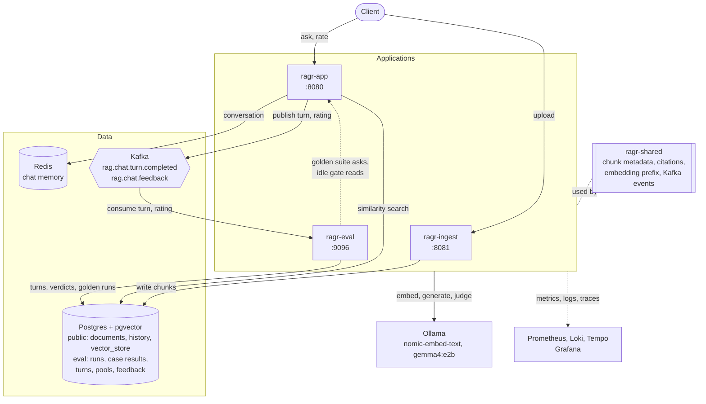
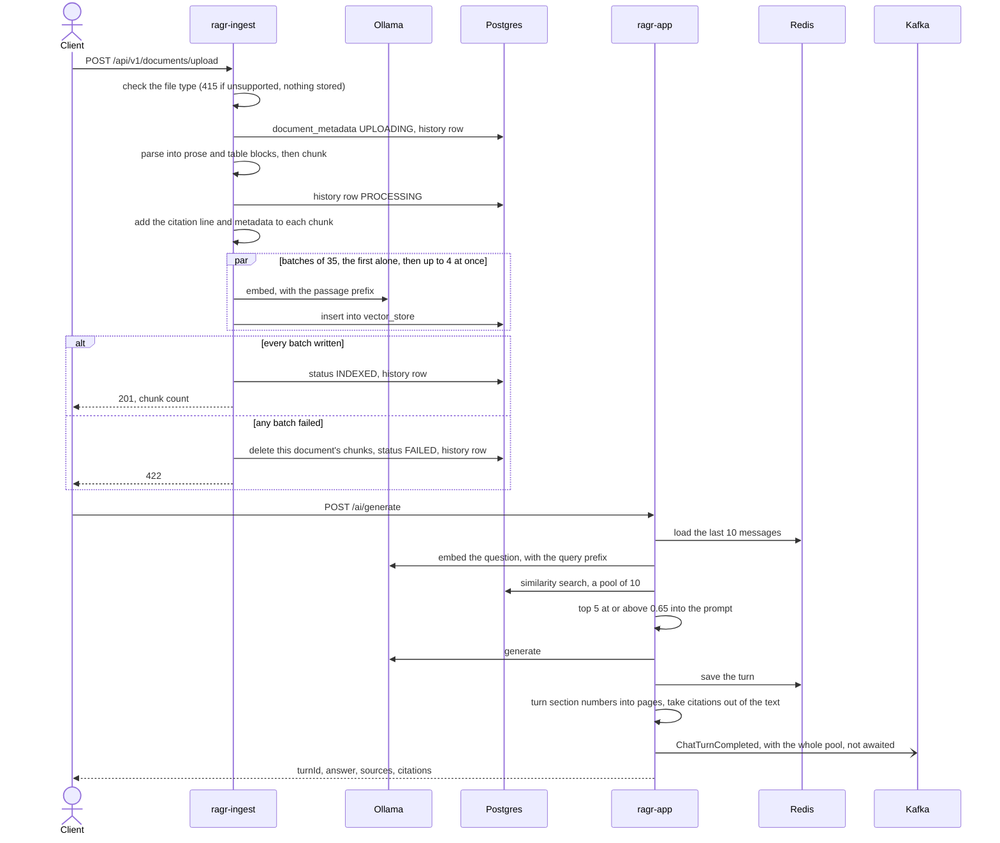
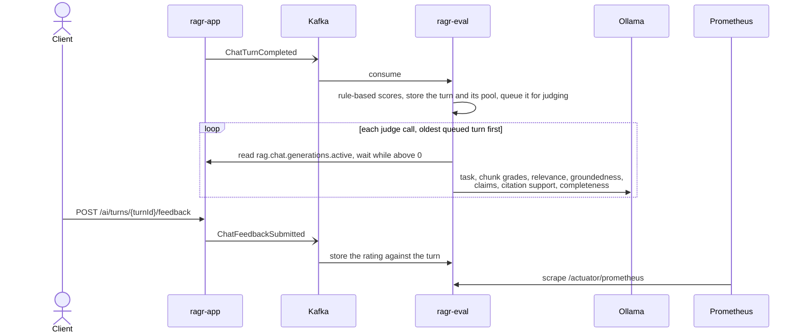

# Spring AI RAG Service

A Retrieval-Augmented Generation (RAG) system built on Spring Boot and Spring AI.

1. **Upload** documents. They are parsed, split into chunks, embedded and stored in Postgres with
   pgvector.
2. **Ask** questions. A chat service answers from those chunks and cites the pages it used.
3. **Measure** the answers. Every answer is scored in a separate service, on live traffic and against
   a fixed set of test questions, without slowing chat down.

Everything runs locally. **Ollama** serves the models, so no API key is needed.

## Modules

A Maven multi-module build: three Spring Boot applications, each in its own process, and one library
they share.

| Module | Job | Ports | Owns | Details |
|---|---|---|---|---|
| `ragr-ingest` | Upload, parse, chunk, embed and store documents | `8081`, actuator `9097` | the `public` schema, `vector_store` included | [ragr-ingest/README.md](ragr-ingest/README.md) |
| `ragr-app` | Chat: retrieve, answer, cite, remember | `8080`, actuator `9095` | `compose.yaml` - it starts the containers | [ragr-app/README.md](ragr-app/README.md) |
| `ragr-eval` | Score and judge every answer, store ratings and reviews, run the golden suite | `9096` (actuator and human review) | the `eval` schema | [ragr-eval/README.md](ragr-eval/README.md) |
| `ragr-shared` | The contracts between the applications | - | - | [ragr-shared/README.md](ragr-shared/README.md) |

## Design principles

These are the choices the rest of the code follows. Each module's README shows where they apply.

1. **The applications share data, not calls.** Ingest writes chunks to the database, chat reads them.
   Chat publishes each answer to Kafka, evaluation reads it. Any one of them can be stopped without
   breaking the others.
2. **Evaluation never slows down chat.** Scoring runs in another process, and the AI judges wait until
   no chat answer is being generated, because both use the same local model.
3. **Every answer carries its evidence.** Each chunk's text starts with its source and page, so the
   model can cite them. Citations are checked and returned as data next to the answer, not left in the
   prose.
4. **A corpus comes from one pipeline.** Change how documents are parsed, chunked or embedded and every
   document is uploaded again. Old and new chunks are never mixed.
5. **Ingestion is all or nothing.** A document that fails half-way has every chunk already written
   removed, so search never finds a partial document.
6. **Measure before deciding.** Thresholds, batch sizes, memory limits and model choices were each set
   from a measurement on the reference machine, and the code comments say which.
7. **Built for a small machine.** Every JVM has a capped heap and the serial garbage collector, so the
   three applications and two models fit in memory together.

## Architecture



### The applications never call each other

There are two read-only exceptions. The golden suite sends its questions to chat's real endpoint.
And ragr-eval reads chat's `rag.chat.generations.active` gauge, so its judges never run while a user
is waiting on the same model.

Otherwise the applications are tied together only by these contracts:

- **`vector_store`, from ingest to chat.** Ingest writes chunks; chat searches them.
  - Every chunk's text begins with a `[filename, p. N]` citation line - plus a `Section:` line when it
    starts part-way through a section. This line is what lets the model cite pages at all.
  - Its metadata uses the keys in `ragr-shared`'s `ChunkMetadata`.
  - **Both applications must embed with the same model** (`nomic-embed-text`, 768 dimensions), since
    chat embeds each question to search what ingest embedded. A different dimension fails loudly; a
    different model with the same dimension fails silently, with poor matches and no error.
  - The same goes for the model's **task prefixes**, which are a pair: `search_document: ` on passages
    in ragr-ingest, `search_query: ` on questions in ragr-app (`app.embedding.task-prefix`).
- **`ChatTurnCompleted` on Kafka, from chat to eval.** One event per answer: the question, the answer,
  the chunks in the prompt and the rest of the retrieved pool (text, metadata and scores), timings and
  token usage. So evaluation never queries the vector store, always scores exactly what the model saw,
  and can see what retrieval left out.
- **`ChatFeedbackSubmitted` on Kafka, from chat to eval.** A user's thumbs up or down, keyed by the
  `turnId` the answer came back with.

What follows from this: with ragr-eval down, chat is unaffected and turns wait on the topic until it
returns; with ragr-ingest down, chat still answers from what is already stored. And a change to one
side of a contract is a change to both.

### Flows across the applications

**A document, from upload to answer.** Upload is synchronous: once it returns, chat can find the chunks.



**An answer, from chat to dashboard.** Free, rule-based scores are ready seconds after the answer.
The AI judges are queued, and run only while chat is idle.



**The golden suite** is the one flow that goes the other way. A test in ragr-eval sends each curated
question to the running ragr-app, marked `X-Eval-Origin: GOLDEN`, reads the turn back off Kafka,
scores it against the pages known to hold the answer, and records the run in the `eval` schema. Live
metrics leave golden turns out. See [ragr-eval](ragr-eval/README.md#the-golden-suite).

### Changing the pipeline means re-ingesting everything

After any change to parsing, chunking, the chunk-size settings, the citation line, the embedding model
or its task prefix, delete every document and upload them all again. There is no re-index endpoint.

Each chunk records a `pipelineVersion`, a hash of what shaped it, so evaluation can tell results from
before and after a change apart. It is a label, not permission to mix: a corpus is always the product
of one pipeline.

## Prerequisites

* Java 26
* Maven
* Docker, for the containers in `compose.yaml`
* [Ollama](https://ollama.com) running locally, with both models pulled:

```bash
ollama pull nomic-embed-text
```

```bash
ollama pull gemma4:e2b
```

The applications reach Ollama at `http://localhost:11434` (`spring.ai.ollama.base-url`), or at
`http://host.docker.internal:11434` when they run as containers. Change it in each if Ollama runs
elsewhere.

### Ollama: turn on the integrated GPU

**Ollama ignores an integrated GPU unless told otherwise**, and runs everything on the CPU. Turning it
on is the biggest single speed-up this project has. On the reference machine it roughly doubled
embedding speed (~830 → ~1,750 tokens/s), taking the 645-page manual from 415 s to 221 s, and made a
grounded answer about 2.5× faster (106 s → 42 s):

```bash
setx OLLAMA_IGPU_ENABLE 1
```

That is for Windows; export it on Linux or macOS. Quit and restart Ollama fully afterwards, since it
reads its environment only at startup. To check, look for `Vulkan0 model buffer size` rather than
`CPU model buffer size` in Ollama's `server.log`.

`OLLAMA_NUM_PARALLEL` does **not** help: Ollama gives an embedding model a single slot regardless, and
chat and the judges share one runner.

## Running

Each application runs either **on the host** (IntelliJ or Maven) or **as a container**, chosen per
application. Both use the same ports, so Swagger, the curl examples, Prometheus, Grafana and the golden
suite work the same either way. An application can run in only one mode at a time, because the second
copy cannot bind its ports.

Ollama always runs on the host, where it can use the GPU. Containers reach it at
`host.docker.internal:11434`.

### As containers

`ragr.ps1` drives everything. The whole stack, infrastructure and all three applications:

```bash
./ragr.ps1 stack up
```

```bash
./ragr.ps1 stack stop
```

```bash
./ragr.ps1 stack down
```

- `stack up` packages the jars, starts the infrastructure, then builds and starts the applications.
- `stack stop` stops every container and keeps it, for a quick restart.
- `stack down` also removes the containers and the network. `docker-volume/` (the data) is kept.

Both stop the applications first, while Kafka, Loki and the OpenTelemetry collector are still up to
take their last turns, logs and traces. An application running from IntelliJ is left alone, with a
warning that its infrastructure has gone.

The `docker` commands act on the applications only - all three, or the ones named (`app`, `ingest`,
`eval`) - and leave the infrastructure running:

```bash
./ragr.ps1 docker up
```

```bash
./ragr.ps1 docker restart ingest
```

```bash
./ragr.ps1 docker stop app
```

```bash
./ragr.ps1 status
```

```bash
./ragr.ps1 logs ingest
```

```bash
./ragr.ps1 intellij ingest
```

- `docker up` packages the jars on the host, starts the infrastructure, builds the images, and returns
  once each container's healthcheck passes. It refuses to start an application already running on the
  host, rather than kill a process the IDE owns.
- `docker restart` packages and recreates even when nothing changed.
- `status` shows each application's mode, health and container, and which Ollama models are loaded.
- `logs` follows a container's log; Ctrl+C stops following, not the application.
- `intellij` stops the containers named, so an IntelliJ run can take their ports.

Logs reach Loki in either mode, so Grafana shows them whichever way an application runs.

**The images.** The root `Dockerfile` builds each one from the jar already in the module's `target/`,
on `eclipse-temurin:26-jre-noble`. It copies Spring Boot's layers separately, so a code change rebuilds
only the small application layer (~190 kB for ragr-app) and the ~90 MB of dependencies come from cache.
The reference manual under ragr-app's `resources/docs` is kept out of the jar, since nothing reads it
from the classpath. Only the connection addresses differ from a host run: `compose.yaml` sets them as
environment variables over the `localhost` defaults in each application's YAML.

**The `apps` profile.** The three application containers sit behind it, so plain `docker compose`
commands still mean the infrastructure only:

| Command | Effect |
|---|---|
| `docker compose up -d` | infrastructure only - also what ragr-app's Docker Compose support runs |
| `docker compose --profile apps up -d --build` | infrastructure and all three applications, from whatever jars are in `target/` (`ragr.ps1` packages them first) |
| `docker compose stop` / `down` | the infrastructure only. The application containers keep running, and `down` then fails to remove the network |
| `docker compose --profile apps down` | everything - what `./ragr.ps1 stack down` does, applications first |

Do not set `COMPOSE_PROFILES=apps` in a `.env` file or the environment. Compose reads it, and an
IntelliJ-launched ragr-app would then start its own container as well.

**Memory limits.** Each container's limit sits above its JVM's worst case - the heap cap plus what the
JVM uses outside the heap - so a full heap ends in an `OutOfMemoryError` rather than a silent kill:

| Container | Heap cap | Limit | Measured |
|---|---|---|---|
| `ai_ragr-app` | 384 MB | 650 MB | 367 MiB after a grounded answer, 218 MiB of it outside the heap |
| `ai_ragr-ingest` | 512 MB | 850 MB | 631 MiB at peak, storing the 645-page reference manual |
| `ai_ragr-eval` | 256 MB | 480 MB | 276 MiB consuming turns |

**Shutdown.** Each container has a 40 s `stop_grace_period`. Without it, Docker here waited only 3 s
before killing the JVM, cutting off any request in flight along with its last logs and traces. 40 s
covers Spring Boot's 30 s graceful shutdown: long enough for an upload or a judge call to finish or be
interrupted cleanly, though a grounded chat answer still running at 30 s is abandoned.

### On the host

With Docker and Ollama running, start the applications **in this order**, each in its own terminal or
from the IntelliJ run configurations:

```bash
./mvnw spring-boot:run -pl ragr-app -am
```

```bash
./mvnw spring-boot:run -pl ragr-ingest -am
```

```bash
./mvnw spring-boot:run -pl ragr-eval -am
```

- **Chat goes first** because it starts the containers, through Spring Boot's Docker Compose support.
  The other two expect them to be running and never start or stop containers.
- **Ingest goes second** because it creates the `public` schema. Until it has started once on an empty
  database, chat has no `vector_store` to search.

**Every JVM has a capped heap and SerialGC**, because the reference machine is short of memory. The
settings are in each module's `pom.xml` (for `spring-boot:run` and for tests) and in
`JDK_JAVA_OPTIONS` (for containers). An IntelliJ run configuration needs the same VM options:

| Application | VM options | Measured |
|---|---|---|
| `ragr-app` | `-Xmx384m -XX:+UseSerialGC` | 104 MB heap, 333 MB in total over three chat answers |
| `ragr-ingest` | `-Xmx512m -XX:+UseSerialGC` | 210 MB heap, 516 MB in total storing the 645-page reference manual |
| `ragr-eval` | `-Xmx256m -XX:+UseSerialGC` | 63 MB heap, 265 MB in total |

On heaps this small, G1's own bookkeeping costs 63-68 MB per JVM. Switching ragr-app and ragr-ingest to
SerialGC saved about 290 MB at peak between them; their `pom.xml` comments have the comparison.

```bash
./mvnw test
```

```bash
./mvnw clean package
```

`./mvnw test` runs every module's tests except the golden suite, which needs the running chat service -
see [ragr-eval](ragr-eval/README.md#the-golden-suite).

**API docs.** `http://localhost:8080/swagger-ui.html` for chat and diagnostics,
`http://localhost:8081/swagger-ui.html` for documents. ragr-eval's one endpoint, human review, is in
[its README](ragr-eval/README.md#human-review).

## Infrastructure (`compose.yaml`)

| Service | Port | What it is |
|---|---|---|
| **pgvector** | `5432` | PostgreSQL 16 with the pgvector extension. Database `ragdatabase`, user `myuser` / `secret`. Two schemas, each with its own Flyway history: `public` (ragr-ingest's) and `eval` (ragr-eval's) |
| **pgadmin** | `5050` | Postgres admin UI. `admin@localhost.com` / `admin` |
| **redis** | `6379`, UI `8001` | Redis Stack, the chat memory store |
| **kafka** | `9092` | Apache Kafka 4.3.1 (GraalVM native image), single node, KRaft, no authentication. Two topics, one partition each, 3-day retention: `rag.chat.turn.completed` (every answer) and `rag.chat.feedback` (every rating). Data in `docker-volume/kafka`. Containers use an internal listener, `kafka:29092`, which is not published |
| **kafka-console** | `8082` | Redpanda Console, a browser UI for Kafka, no login. Read the stored events as JSON, and see the `ragr-eval` consumer group's offsets and lag |
| **redis-exporter** | `9121` | Redis metrics for Prometheus |
| **postgres-exporter** | `9187` | Postgres metrics for Prometheus, with the table and index statistics collectors on, so `vector_store` index versus sequential scans are visible |
| **otel-collector** | `4317` gRPC, `4318` HTTP | OpenTelemetry Collector |
| **prometheus** | `9090` | Metrics |
| **grafana** | `3000` | Dashboards, with Prometheus, Loki, Tempo and Postgres data sources. Anonymous access as Admin, no login |
| **tempo** | `3200` | Traces |
| **loki** | `3100` | Logs |
| **ragr-app**, **ragr-ingest**, **ragr-eval** | as above | The applications, behind the `apps` profile so none of the above starts them. See [As containers](#as-containers) |

## Observability

Each application serves the `health`, `metrics` and `prometheus` actuator endpoints on its own port
and is its own Prometheus job. Every meter is tagged `application=<name>`, which is what the dashboard
panels select on:

| Application | Actuator | Prometheus job | `application` tag |
|---|---|---|---|
| `ragr-app` | `9095` | `spring-ai-ragr` | `spring-ai-ragr` |
| `ragr-ingest` | `9097` | `ragr-ingest` | `ragr-ingest` |
| `ragr-eval` | `9096` | `ragr-eval` | `ragr-eval` |

Grafana has four dashboards, each answering one question, linked to each other from the "ragr
dashboards" menu at the top left:

* **ragr — overview** - *are the applications and the infrastructure healthy?* JVM, HTTP and connection
  pools for all three applications (pick one with the `application` selector); Kafka from the
  applications' side (turns published and dropped, evaluation's consumer lag), with links into the
  Kafka console; Redis; and Postgres, including row counts per schema and table.
* **ragr-app — chat** - *is the chat pipeline healthy?* See [ragr-app](ragr-app/README.md#dashboard).
* **ragr-ingest — ingestion** - *is storing documents healthy?* See [ragr-ingest](ragr-ingest/README.md#dashboard).
* **ragr-eval — evaluation** - *are the answers any good?* See [ragr-eval](ragr-eval/README.md#dashboard).

The Postgres data source shows what only the database knows: how long each upload took, from
`document_metadata_history`, and the golden suite's per-question results, from the `eval` schema.

**Moving between signals.** Grafana links logs, traces and metrics to each other:

- logs ↔ traces;
- metrics → traces, through exemplars on the latency and call-rate panels (the overview's HTTP panels,
  and the chat and ingestion dashboards): hover a dot, then **Query with Tempo**;
- traces → logs, from a span's **Links → Related logs**;
- metrics → logs, through a correlation on the `job` field, shown in Table view.

All three applications send traces to Tempo. A request that logs nothing, such as listing
conversations, has no related logs to show.

## Technologies

* Spring Boot 4.1.0, Spring AI 2.0.1, Java 26
* Ollama (`gemma4:e2b` for chat and judging, `nomic-embed-text` for embeddings)
* PostgreSQL with pgvector, Flyway
* Redis
* Kafka (Spring for Apache Kafka), Redpanda Console
* springdoc-openapi
* Docker Compose
* OpenTelemetry, Prometheus, Grafana, Tempo, Loki
