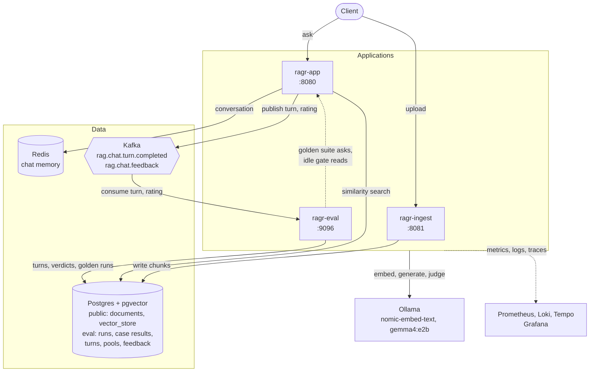
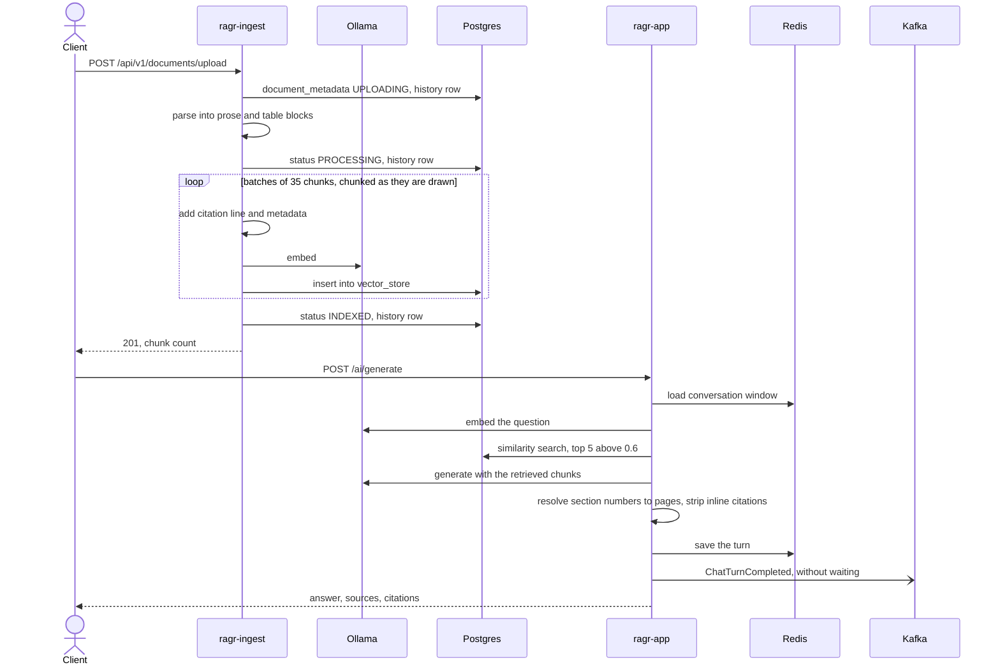
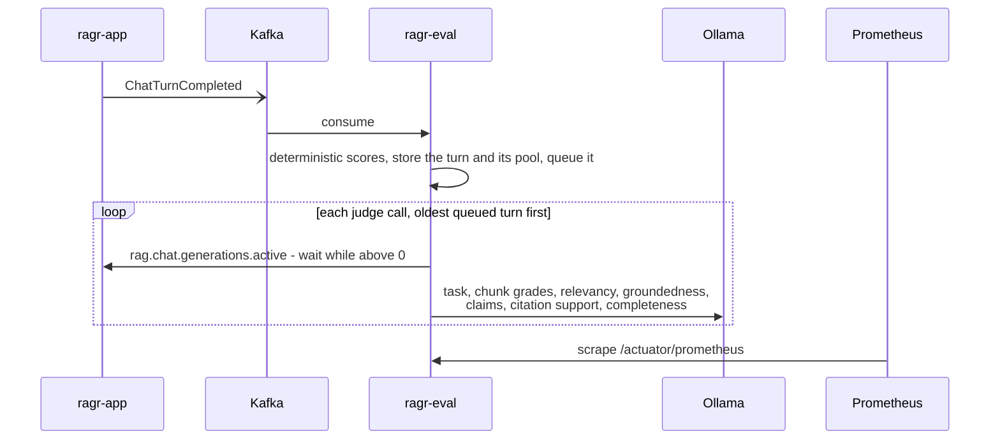

# Spring AI RAG Service

A Spring Boot Retrieval-Augmented Generation (RAG) system. Upload documents and they are parsed,
chunked and stored as embeddings in Postgres/pgvector; a chat interface answers questions grounded in
that content, citing the pages it used; and answer quality is measured continuously, off the chat
path, on live traffic and against a curated regression set.

Everything runs locally: the models are served by **Ollama**, so no API key is needed.

## Modules

The repository is a Maven multi-module build. Three of the modules are separate Spring Boot
applications, each running in its own process; the fourth is a library they share.

| Module | Role | Ports | Owns | Details |
|---|---|---|---|---|
| `ragr-ingest` | Upload, parse, chunk, embed and index documents | `8081`, actuator `9097` | the `public` schema, `vector_store` included | [ragr-ingest/README.md](ragr-ingest/README.md) |
| `ragr-app` | Chat: retrieve, generate, cite, remember | `8080`, actuator `9095` | `compose.yaml` - it starts the containers | [ragr-app/README.md](ragr-app/README.md) |
| `ragr-eval` | Store, score and judge every chat turn; record ratings and reviews; run the golden suite | `9096` (actuator and human review) | the `eval` schema | [ragr-eval/README.md](ragr-eval/README.md) |
| `ragr-shared` | The contracts between the applications | - | - | [ragr-shared/README.md](ragr-shared/README.md) |

## Architecture



### The applications never call each other

With two read-only exceptions - the golden suite driving chat's real endpoint, and ragr-eval reading
chat's `rag.chat.generations.active` gauge so its judges never run while a user is waiting on the same
model - the three applications share no HTTP calls. Each is coupled to the others only through data, by
these contracts:

- **`vector_store`, from ingest to chat.** ragr-ingest writes chunks, ragr-app searches them. Every
  chunk's stored text begins with a `[filename, p. N]` citation line, which is what lets the model
  cite pages at all - with a `Section:` line under it when the chunk starts mid-section - and carries the metadata keys in `ragr-shared`'s `ChunkMetadata`. **The embedding
  model and its dimensions must be identical in both applications** (`nomic-embed-text`, 768), because
  chat embeds each query with the same model to search what ingest wrote. A different dimension fails
  loudly at query time; a different model with the same dimension fails silently, returning poor
  matches with no error.
- **`ChatTurnCompleted` on Kafka, from chat to eval.** Each completed turn is published carrying the
  question, the resolved answer, the full text, metadata and scores of the chunks in the prompt and of
  the rest of the candidate pool, timings and token usage. So evaluation never queries the vector store,
  always scores what the model actually saw, and can measure recall against what retrieval left out.
- **`ChatFeedbackSubmitted` on Kafka, from chat to eval.** A user's thumbs up or down on a turn,
  by the `turnId` the answer came back with.

Two consequences follow. Each application can be stopped without breaking the others: with ragr-eval
down, chat is unaffected and turns wait on the topic until it returns; with ragr-ingest down, chat still answers
from what is already indexed. And a change on one side of a contract is a change to both.

### Flows across the applications

**A document, from upload to answer.** Ingestion is synchronous; chat can retrieve a chunk as soon as
the upload returns.



**A turn, from chat to dashboard.** Deterministic scoring happens seconds after the answer, in another
process; judging is queued and runs only while no chat generation is in flight.



**The golden suite** is the one flow that crosses back: a test in ragr-eval sends each curated
question to the running ragr-app, marked `X-Eval-Origin: GOLDEN`, then reads that turn back off Kafka,
scores it against the pages known to hold the answer, and records the run in the `eval` schema. Live
metrics leave golden turns out. See [ragr-eval/README.md](ragr-eval/README.md#the-golden-suite).

### Changing the pipeline means re-ingesting everything

Chunks are not versioned. After any change to parsing, chunking, the chunk-size settings, the citation
line or the embedding model, delete every document and upload them all again. A corpus is always the
product of one pipeline; mixing old and new chunks is not supported, and nothing detects it.

## Prerequisites

* Java 26
* Maven
* Docker (for the containers in `compose.yaml`)
* [Ollama](https://ollama.com) running locally with both models pulled:

```bash
ollama pull nomic-embed-text
ollama pull gemma4:e2b
```

No API key is needed. All three applications call Ollama at `http://localhost:11434`
(`spring.ai.ollama.base-url`), or `http://host.docker.internal:11434` when they run as containers;
override it in each if Ollama runs elsewhere.

### Ollama: enable the integrated GPU

Ollama **ignores an integrated GPU unless you tell it not to**, and then everything runs on the CPU.
This is the single biggest lever on this project's speed. On a test machine it roughly doubled
embedding throughput (~830 → ~1,750 tokens/sec), taking a 645-page PDF from 415s to 221s, and made a
grounded chat turn ~2.5× faster (106s → 42s):

```bash
setx OLLAMA_IGPU_ENABLE 1      # Windows; export it on Linux/macOS
```

Fully quit and relaunch Ollama afterwards; it only reads its environment at startup. To confirm it
took effect, look for `Vulkan0 model buffer size` (rather than `CPU model buffer size`) in Ollama's
`server.log`.

`OLLAMA_NUM_PARALLEL` does **not** help: Ollama pins embedding models to a single slot regardless, and
the chat model and the evaluation judges share one runner too.

## Running

Each application runs either **on the host** (IntelliJ or Maven) or **as a container** from
`compose.yaml`, chosen per application and per run. Both publish the same ports, so everything else -
Swagger, the curl examples, Prometheus, Grafana, the golden suite - works the same either way. An
application can only be up in one mode at a time: the second instance cannot bind its ports.

Ollama stays native on the host in both modes, for the integrated GPU; containers reach it at
`host.docker.internal:11434`.

### As containers

The whole stack - the infrastructure and all three applications:

```bash
./ragr.ps1 stack up                 # package, start the infrastructure, build and start the applications
```

```bash
./ragr.ps1 stack stop               # stop every container and keep it, for a quick restart
```

```bash
./ragr.ps1 stack down               # stop and remove every container and the network; docker-volume/ is kept
```

`stack stop` and `stack down` stop the applications first, while Kafka, Loki and the OTel collector are
still up to take their last turns, logs and spans. An application running from IntelliJ is left
alone, with a warning that it has lost its infrastructure.

The `docker` commands act on the applications only, all three or the ones named, and leave the
infrastructure running:

```bash
./ragr.ps1 docker up                # all three; or name some: app, ingest, eval
```

```bash
./ragr.ps1 docker restart ingest    # re-package and recreate one
```

```bash
./ragr.ps1 docker stop app
```

```bash
./ragr.ps1 status                   # mode, health and container per application, and resident Ollama models
```

```bash
./ragr.ps1 logs ingest              # follow a container's log; Ctrl+C stops following, not the app
```

```bash
./ragr.ps1 intellij ingest          # stop the container so an IntelliJ run can take the ports
```

`up` packages the jars with Maven on the host, starts the infrastructure, builds the images and starts
the containers detached, returning once each one's healthcheck passes. It refuses to start an
application that is already running on the host, rather than killing a process the IDE owns. Logs
also reach Loki, so Grafana shows them in either mode.

The images are built by the root `Dockerfile` from the jar already in each module's `target/`, on
`eclipse-temurin:26-jre-noble`, split into Spring Boot's layers so a code change rebuilds only the
application layer (~190 kB for ragr-app) while the ~90 MB dependencies layer comes from cache. The
reference manual under ragr-app's `resources/docs` is kept out of the jar, since nothing reads it from
the classpath. Only the connection addresses differ from a host run, as
environment variables in `compose.yaml` over the `localhost` defaults in each application's YAML.

The three services sit behind the `apps` compose profile, so plain `docker compose` commands still mean
the infrastructure only:

| Command | Effect |
|---|---|
| `docker compose up -d` | infrastructure only - also what ragr-app's Docker Compose support runs |
| `docker compose --profile apps up -d --build` | infrastructure and all three applications, from whatever jars are in `target/` (`ragr.ps1` packages them first) |
| `docker compose stop` / `down` | the infrastructure only; the application containers keep running, and `down` then fails to remove the network |
| `docker compose --profile apps down` | everything - `./ragr.ps1 stack down` does the same, applications first |

Do not set `COMPOSE_PROFILES=apps` in a `.env` file or the environment: compose reads it, and an
IntelliJ-launched ragr-app would then start its own container.

Each container has a memory limit above its JVM's worst case - heap cap plus what the JVM uses outside
the heap - so a full heap ends in an `OutOfMemoryError` rather than a silent kill:

| Container | Heap cap | Limit | Measured |
|---|---|---|---|
| `ai_ragr-app` | 384 MB | 650 MB | 367 MiB after a grounded turn, 218 MiB of it outside the heap |
| `ai_ragr-ingest` | 512 MB | 850 MB | 631 MiB peak indexing the 645-page reference manual |
| `ai_ragr-eval` | 256 MB | 480 MB | 276 MiB consuming turns |

Each also has a 40 s `stop_grace_period`. Without one, Docker here waits only 3 s after SIGTERM before
killing the JVM, which cut off any request in flight and the last logs and spans with it (exit 137).
40 s covers Spring Boot's 30 s graceful-shutdown window - long enough for an upload or a judgement to
finish or be interrupted, though not for a full grounded chat answer, which is abandoned at 30 s.

### On the host

Ensure Docker and Ollama are running, then start the applications **in this order**, each in its own
terminal (or with the IntelliJ run configurations):

```bash
./mvnw spring-boot:run -pl ragr-app -am
```

```bash
./mvnw spring-boot:run -pl ragr-ingest -am
```

```bash
./mvnw spring-boot:run -pl ragr-eval -am
```

The chat service goes first because it brings up the containers, through Spring Boot's Docker Compose
support; the other two expect the stack it started and never start or stop containers. ragr-ingest
runs the `public` schema's Flyway migration, so on an empty database chat has no `vector_store` to
search until ingestion has started once.

Every JVM runs with a capped heap and SerialGC on this memory-constrained host, set in each module's
`pom.xml` for `spring-boot:run` and for its tests, and in `JDK_JAVA_OPTIONS` for its container. An
IntelliJ run configuration needs the same VM options:

| Application | VM options | Measured |
|---|---|---|
| `ragr-app` | `-Xmx384m -XX:+UseSerialGC` | 104 MB heap, 333 MB private over three chat turns |
| `ragr-ingest` | `-Xmx512m -XX:+UseSerialGC` | 210 MB heap, 516 MB private indexing the 645-page reference manual |
| `ragr-eval` | `-Xmx256m -XX:+UseSerialGC` | 63 MB heap, 265 MB private |

On heaps this size G1's own structures cost 63-68 MB per JVM; moving ragr-app and ragr-ingest to
Serial saved about 290 MB at peak between them. Their pom comments carry the G1 comparison.

```bash
./mvnw test            # every module's tests; the golden suite is excluded, see ragr-eval
./mvnw clean package
```

OpenAPI docs are served by each application with an API once it is running:
`http://localhost:8080/swagger-ui.html` for chat and diagnostics, `http://localhost:8081/swagger-ui.html`
for documents. ragr-eval's one endpoint, human review of evaluated turns, is in
[ragr-eval/README.md](ragr-eval/README.md#human-review).

## Infrastructure (`compose.yaml`)

* **pgvector** — PostgreSQL 16 + pgvector extension. Port `5432`, db `ragdatabase`, user `myuser` / `secret`. Two schemas: `public` (ragr-ingest's) and `eval` (ragr-eval's), each with its own Flyway history.
* **pgadmin** — Postgres admin UI. Port `5050`, `admin@localhost.com` / `admin`.
* **redis** — Redis Stack, used as the chat memory store. Ports `6379` (Redis), `8001` (UI).
* **kafka** — Apache Kafka 4.3.1 (the GraalVM native image), single-node KRaft. Port `9092`, no authentication. Carries each completed chat turn on the `rag.chat.turn.completed` topic (one partition, 3-day retention). Data persists under `docker-volume/kafka`. Containers reach it on an internal listener, `kafka:29092`, which is not published.
* **kafka-console** — Redpanda Console, a browser UI for the broker. Port `8082`, no login. Browse topics, read the retained chat turns as decoded JSON, and see the `ragr-eval` consumer group's offsets and lag.
* **redis-exporter** — Exposes Redis metrics to Prometheus. Port `9121`.
* **postgres-exporter** — Exposes server-side Postgres metrics to Prometheus. Port `9187`. Runs with the `stat_user_tables` and `statio_user_indexes` collectors enabled so `vector_store` index-vs-sequential scan counts are visible.
* **otel-collector** — OpenTelemetry Collector. Ports `4317` (gRPC), `4318` (HTTP).
* **prometheus** — Metrics. Port `9090`.
* **grafana** — Dashboards, with Prometheus, Loki, Tempo and Postgres datasources provisioned. Port `3000`, anonymous access with the Admin role (no login).
* **tempo** — Distributed tracing backend. Port `3200`.
* **loki** — Log aggregation. Port `3100`.
* **ragr-app**, **ragr-ingest**, **ragr-eval** — the applications themselves, behind the `apps` profile, so none of the above starts them. Same ports as a host run. See [As containers](#as-containers).

## Observability

Each application serves `health`, `metrics` and `prometheus` actuator endpoints on its own port, and
each is its own Prometheus job. Their meters are tagged `application=<name>`, which is what every
dashboard panel selects on:

| Application | Actuator | Prometheus job | `application` tag |
|---|---|---|---|
| `ragr-app` | `9095` | `spring-ai-ragr` | `spring-ai-ragr` |
| `ragr-ingest` | `9097` | `ragr-ingest` | `ragr-ingest` |
| `ragr-eval` | `9096` | `ragr-eval` | `ragr-eval` |

Grafana has four dashboards, linked to each other from the "ragr dashboards" menu top left, each
answering a different question:

* **ragr — overview** — *are the applications and the infrastructure healthy?* JVM runtime, HTTP / Spring MVC and HikariCP for all three applications, split by an `application` selector; Kafka from the client side (turns published vs dropped, evaluation consumer lag), with links into the Kafka console; Redis; and Postgres, including row counts per schema and table.
* **ragr-app — chat** — *is the chat pipeline healthy?* See [ragr-app](ragr-app/README.md#dashboard).
* **ragr-ingest — ingestion** — *is indexing healthy?* See [ragr-ingest](ragr-ingest/README.md#dashboard).
* **ragr-eval — evaluation** — *are the answers any good?* See [ragr-eval](ragr-eval/README.md#dashboard).

The Postgres datasource reads what only the database knows: per-document upload timings from
`document_metadata_history`, and the golden suite's per-case results from the `eval` schema.

Grafana is wired so you can move between signals: logs ↔ traces, metrics → traces (via exemplars on
the overview's HTTP panels and the chat and ingestion dashboards' latency and call-rate panels -
hover a dot, then **Query with Tempo**), traces → logs (a span's **Links → Related logs**), and
metrics → logs (via a correlation on the `job` field, shown in Table view). All three applications
export their traces to Tempo; a request that logs nothing, such as listing conversations, has no
related logs to show.

## Technologies

* Spring Boot 4.1.0, Spring AI 2.0.1, Java 26
* Ollama (`gemma4:e2b` for chat and judging, `nomic-embed-text` for embeddings)
* PostgreSQL with pgvector, Flyway
* Redis
* Kafka (Spring for Apache Kafka), Redpanda Console
* springdoc-openapi
* Docker Compose
* OpenTelemetry, Prometheus, Grafana, Tempo, Loki (observability)
