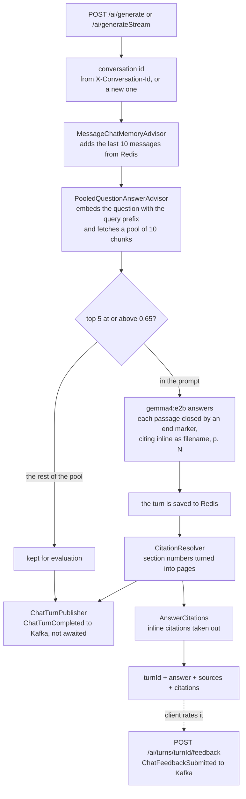

# ragr-app

The chat service. It answers questions from the indexed documents, cites the pages it used, and
remembers each conversation. It runs on port **8080** (actuator **9095**).

- It **reads** the `vector_store` that [ragr-ingest](../ragr-ingest/README.md) writes.
- It **publishes** every finished turn, and every rating, to Kafka for
  [ragr-eval](../ragr-eval/README.md) to score.
- It **owns `compose.yaml`**: started from the host, it brings up the containers the others need.

How it fits with the other applications is in the [root README](../README.md).

## Design choices

- **Evaluation never slows down an answer.** The turn is handed to Kafka without waiting. If Kafka
  is down, the turn is counted as dropped and the user still gets the answer.
- **Citations come back as data, not text.** The model cites inline as `(filename, p. N)`. Those
  citations are checked, fixed where possible, and then taken out of the answer and returned in a
  separate `citations` list, so a client never has to parse prose.
- **Retrieval fetches more than the prompt needs.** One vector query fetches a pool of 10 chunks.
  The prompt gets the top 5 above the similarity threshold, exactly what Spring AI's stock
  `QuestionAnswerAdvisor` would give it. The rest of the pool goes to evaluation, which uses it to
  measure what retrieval left out. A pool of 10 costs the same as 5.
- **Nothing about a turn is stored here.** Redis holds the conversation window and nothing else. Turns,
  scores and ratings live in ragr-eval.

## The flow



While a generation runs, the gauge `rag.chat.generations.active` is above zero. ragr-eval reads it
and holds its judges until chat is idle, because both share one Ollama runner.

Some details of each step:

- **The question is searched as written.** A follow-up that only makes sense in context ("and what
  about the port?") retrieves poorly, because the conversation is not part of the search.
- **Each passage in the prompt ends with `(end of passage)`.** Without it the model attached a passage
  to the source line of the next one and cited the wrong page.
- **Fixing citations.** The model sometimes writes a section number where a page belongs: `p. 5.3`,
  `p. 926` for section 9.2.6, or `p. 913.1` for 9.13.1. `CitationResolver` rewrites it to the page that
  heading sits on, using only the chunks that were in the prompt. A page the model was actually shown
  is never changed.
- **Streaming strips as it goes.** It holds back text only from an opening bracket to its close, so a
  citation split across tokens is still caught. The turn is published when the stream completes. A
  failed stream is not published, since a half-delivered answer is not an answer.

## Configuration

`application.yaml` only switches on the `dev` profile. Everything else is in `application-dev.yaml`,
whose comments explain each value.

The embedding model (`nomic-embed-text`, 768 dimensions) must be the same as ragr-ingest's - see the
[root README](../README.md#the-applications-never-call-each-other).

| Property | Default | Purpose |
|---|---|---|
| `app.embedding.task-prefix` | `search_query: ` | Added to every question before it is embedded. Pairs with ragr-ingest's passage prefix, and changes with the model |
| `app.rag.top-k` | `5` | Chunks that reach the prompt |
| `app.rag.similarity-threshold` | `0.65` | Lowest score a chunk needs to reach the prompt |
| `app.rag.pool-size` | `10` | Chunks the one vector query fetches; those beyond the prompt go to evaluation |
| `app.rag.pool-floor` | `0.0` | Lowest score a chunk needs to be in the pool at all |
| `app.ai.max-chat-messages` | `10` | Messages kept per conversation, and replayed to the model on every turn |
| `app.events.chat-turns.enabled` | `true` | Publish finished turns to Kafka |
| `app.events.chat-turns.topic` | `rag.chat.turn.completed` | The turn topic, created at startup |
| `app.events.chat-turns.retention` | `3d` | How long the topic keeps turns |
| `app.events.feedback.topic` | `rag.chat.feedback` | The rating topic, created at startup |
| `app.redis.host`, `app.redis.port` | `localhost`, `6379` | Chat memory's Redis. The container sets `APP_REDIS_HOST=redis` |

None of these change what is stored, so none needs a re-ingest.

From IntelliJ, Postgres is found through Spring Boot's Docker Compose support. In a container, where
that is switched off, `compose.yaml` sets every address - see [Running](../README.md#running).

## Chat API (`/ai`)

| Method | Path | Description |
|---|---|---|
| POST | `/ai/generate` | One JSON answer with its sources and citations. Body: `prompt` (required, up to 4000 characters) and nothing else |
| POST | `/ai/generateStream` | The same answer as Server-Sent Events: the text, then `sources` and `done` events |
| POST | `/ai/turns/{turnId}/feedback` | Rate an answer. Body: `rating` (`UP` or `DOWN`, required), `reason` (optional, up to 1000 characters). Always 202 |
| GET | `/ai/conversations` | List the stored conversation ids |
| GET | `/ai/conversations/{id}` | Read one conversation's messages, oldest first |
| DELETE | `/ai/conversations/{id}` | Delete one conversation |
| DELETE | `/ai/conversations` | Delete all chat memory |

Both generate endpoints take two optional headers:

- **`X-Conversation-Id`** continues a conversation. Leave it out to start one. The id used comes back
  in the response header of the same name.
- **`X-Eval-Origin: GOLDEN`** marks the turn as the golden suite's, so live metrics leave it out.
  `LIVE` is the default; any other value is a 400.

```bash
curl -X POST http://localhost:8080/ai/generate \
  -H 'Content-Type: application/json' \
  -d '{"prompt":"Hello"}'

# Capture the conversation id, then continue that conversation
curl -i -X POST http://localhost:8080/ai/generate -H 'Content-Type: application/json' -d '{"prompt":"Hello"}' | grep -i x-conversation-id
curl -X POST http://localhost:8080/ai/generate -H 'Content-Type: application/json' \
  -H 'X-Conversation-Id: <id>' -d '{"prompt":"And what did I just ask?"}'

curl -N -X POST http://localhost:8080/ai/generateStream \
  -H 'Content-Type: application/json' \
  -d '{"prompt":"Tell me a story"}'

# Rate an answer, by the turnId it came back with
curl -X POST http://localhost:8080/ai/turns/<turnId>/feedback -H 'Content-Type: application/json' \
  -d '{"rating":"DOWN","reason":"cited the wrong page"}'

# Read a conversation back, then delete just that one
curl "http://localhost:8080/ai/conversations/<id>"
curl -X DELETE "http://localhost:8080/ai/conversations/<id>"
```

OpenAPI docs: `http://localhost:8080/swagger-ui.html`.

**Why the prompt is in a JSON body and not the URL.** A `?prompt=` query would write every question
into access logs, browser history and proxy logs, and cap its length at the URL limit. A blank,
missing or over-long prompt returns a 400 `ProblemDetail`.

**Why the conversation id is a header.** It keeps the body to the prompt alone, and works the same for
the streaming endpoint. An id sent in the body is ignored and starts a new conversation.

### The response

```json
{
  "turnId": "c2057d5d-bc55-43bd-bc6d-45e9d4e91a8d",
  "answer": "Starters bundle a curated set of dependencies ...",
  "grounded": true,
  "sources": [
    { "ref": 1, "documentId": "8c1f…", "fileName": "spring-boot-reference.pdf", "page": 42,
      "blockType": "prose", "score": 0.83, "excerpt": "<the chunk's full text>", "cited": true }
  ],
  "citations": [
    { "fileName": "spring-boot-reference.pdf", "page": 42, "status": "VERIFIED", "sourceRef": 1, "writtenPage": null }
  ],
  "usage": { "model": "gemma4:e2b", "promptTokens": 2018, "completionTokens": 495, "latencyMillis": 56381 }
}
```

- **`turnId`** names this one answer. Rating it, judging it and reviewing it all use this id. ragr-app
  keeps no record of turns, so an unknown id is still accepted with a 202.
- **`grounded`** is `false`, with no `sources`, when nothing cleared the threshold and the answer came
  from the model's general knowledge.
- **`sources`** lists every chunk in the prompt, in rank order, with its full text.
- **`citations`** lists each source the answer cites:
  - `VERIFIED` - it points at a source in the prompt.
  - `REPAIRED` - the model wrote a section number (`p. 5.3`, `(5.3)`, `p. 926`) and it was resolved to
    that heading's page. `writtenPage` keeps what the model wrote.
  - `UNVERIFIED` - it points at nothing the model was given.

A grounded answer takes tens of seconds on the reference machine, mostly spent reading the ~3,000-token
prompt the retrieved chunks make.

### Streaming

`/ai/generateStream` sends the answer text as unnamed `data:` events, with citations already removed,
then `event:sources` (`{grounded, sources}`) and `event:done` (`{turnId, citations, usage}`). A
cancelled stream gets neither.

- It is a `POST`, so a browser **cannot** read it with `EventSource`, which only sends `GET`. Use
  `fetch` with a `ReadableStream`.
- **Swagger UI does not show it streaming.** It waits for the whole body, so every event appears at
  once. Use `curl -N` or an SSE-aware client such as Postman to watch events arrive.

### Conversations

**Conversations expire from Redis after 24 hours**, through a time-to-live set in `SpringAiConfig`.

**Only the last 10 messages are kept.** Chat memory is a rolling window
(`app.ai.max-chat-messages`), trimmed whenever a message is saved, so older turns are gone for good.
The response reports `messageCount` and `maxRetainedMessages`: when they are equal, earlier turns were
dropped. A bigger window costs a bigger prompt on every turn, since the window is replayed to the
model.

- Stored history is the model's raw text, so it still shows the inline citations the answer had
  removed.
- `GET` returns 404 when nothing is stored under the id. A deleted conversation reads the same way,
  because Redis keeps no record of deletions.
- `DELETE` of one conversation always returns 204, whether or not it existed.

## Admin diagnostics (`/api/v1/admin`)

Operator checks against the live corpus. **They exist only under the `dev` profile**, and have no
authentication: if the `dev` profile ever runs somewhere reachable, block `/api/v1/admin` at the proxy.

| Method | Path | Description |
|---|---|---|
| POST | `/api/v1/admin/retrieval/search` | What the vector store returns for a query, with scores, without generating an answer |

This runs the same search as chat, so it separates a **retrieval** failure (the passage the answer
needed was never found) from a **generation** failure (it was found and ignored).

```bash
curl -s -X POST http://localhost:8080/api/v1/admin/retrieval/search \
  -H 'Content-Type: application/json' \
  -d '{"query":"what is a spring boot starter"}'
```

- `topK` and `similarityThreshold` default to chat's values, and the response says which were used.
  Pass `{"query":"...","topK":20,"similarityThreshold":0.0}` to see the near misses the threshold cut.
- Pass `documentId` to search one document only.
- Each hit has its `score`, its ingestion metadata (`pageNumber`, `chunkIndex`, `blockType`, and
  `tableIndex` / `tableRows` for tables), and the stored content in two parts: `citation` and `text`.
  `text` starts with the `Section:` line when the chunk has one.
- `hasCitationHeader: false` marks a chunk stored before citation lines existed. The model cannot cite
  it; re-ingest the document.

Like chat, it does not use the conversation, so a follow-up question retrieves here as poorly as it
does there.

## Dashboard

**ragr-app — chat** in Grafana answers *is the chat pipeline healthy?* It shows Ollama call rate,
latency and errors; tokens and generation speed; end-to-end latency and the time spent in each
advisor; and vector-store query rate, latency and index versus sequential scans. JVM, HTTP and
connection-pool panels are on **ragr — overview**, under `application = spring-ai-ragr`. The top bar
links to this application's Swagger UI.
