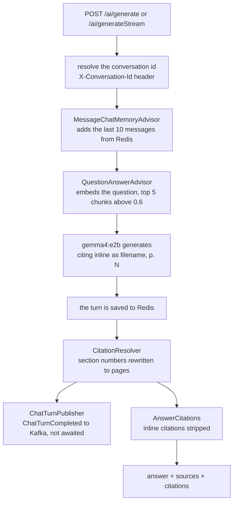

# ragr-app

The chat service: it answers questions grounded in the indexed documents, citing the pages it used,
and remembers each conversation. It runs on port **8080**, actuator on **9095**, and owns
`compose.yaml` - starting it brings up the containers the other applications need. It reads the
`vector_store` that [ragr-ingest](../ragr-ingest/README.md) writes, and publishes every completed turn
for [ragr-eval](../ragr-eval/README.md) to score. For how it fits with the other applications, see the
[root README](../README.md).

## The flow



- **Retrieval is the chat path's own search.** `QuestionAnswerAdvisor` searches with the question as
  written, so a follow-up that only makes sense in context retrieves poorly.
- **Citations are resolved, then removed from the text.** The model is asked to cite inline as
  `(filename, p. N)`, taking the page from each chunk's citation line. It sometimes writes a section
  number where a page belongs - `(spring-boot-reference.pdf, p. 5.3)` - and `CitationResolver` rewrites
  that to the page the heading sits on, using only the chunks it retrieved. The inline citations are
  then stripped from the answer the caller reads and reported beside it instead.
- **Publishing never holds up the answer.** A turn that cannot be sent to Kafka is counted as dropped
  and lost; chat keeps answering whether or not Kafka or ragr-eval is up.
- **The stream strips as it goes**, holding back only from an opening bracket to its close, so a
  citation split across tokens is still caught. The turn is published once the stream completes; a
  failed stream is neither published nor reported, since a half-delivered answer is not an answer.

## Configuration

`src/main/resources/application.yaml` activates the `dev` profile; everything else is in
`application-dev.yaml`, which explains each choice in its comments. The embedding model and its
dimensions (`nomic-embed-text`, 768) must match ragr-ingest's - see the
[root README](../README.md#the-applications-never-call-each-other).

| Property | Default | Purpose |
|---|---|---|
| `app.rag.top-k` | `5` | Chunks retrieved per question |
| `app.rag.similarity-threshold` | `0.6` | Minimum similarity for a chunk to be retrieved |
| `app.ai.max-chat-messages` | `10` | Messages kept per conversation, and replayed to the model on every turn |
| `app.events.chat-turns.enabled` | `true` | Publish completed turns to Kafka for evaluation |
| `app.events.chat-turns.topic` | `rag.chat.turn.completed` | The topic, created at startup |
| `app.events.chat-turns.retention` | `3d` | How long the topic keeps turns |

None of these change what is stored, so none of them need a re-ingest.

## Chat API (`/ai`)

| Method | Path | Description |
|---|---|---|
| POST | `/ai/generate` | Single-shot chat response as JSON: the answer, its sources and citations. JSON body: `prompt` (required, max 4000 chars), and nothing else. Optional header `X-Conversation-Id` continues that conversation. Optional header `X-Eval-Origin: GOLDEN` (upper case; anything else but `LIVE` is a 400) marks the turn as the golden evaluation suite's, which online evaluation leaves out of the live metrics |
| POST | `/ai/generateStream` | Streaming chat response (SSE): answer text, then `sources` and `done` events. Same JSON body and headers as above |
| GET | `/ai/conversations` | List all active conversation IDs |
| GET | `/ai/conversations/{id}` | Read back one conversation's messages, oldest first |
| DELETE | `/ai/conversations/{id}` | Delete a single conversation |
| DELETE | `/ai/conversations` | Clear all stored chat memory |

```bash
curl -X POST http://localhost:8080/ai/generate \
  -H 'Content-Type: application/json' \
  -d '{"prompt":"Hello"}'

# Capture the conversation ID, then continue that conversation
curl -i -X POST http://localhost:8080/ai/generate -H 'Content-Type: application/json' -d '{"prompt":"Hello"}' | grep -i x-conversation-id
curl -X POST http://localhost:8080/ai/generate -H 'Content-Type: application/json' \
  -H 'X-Conversation-Id: <id>' -d '{"prompt":"And what did I just ask?"}'

curl -N -X POST http://localhost:8080/ai/generateStream \
  -H 'Content-Type: application/json' \
  -d '{"prompt":"Tell me a story"}'

# Reload a conversation, then drop just that one
curl "http://localhost:8080/ai/conversations/<id>"
curl -X DELETE "http://localhost:8080/ai/conversations/<id>"
```

OpenAPI docs: `http://localhost:8080/swagger-ui.html`.

The conversation travels in the **`X-Conversation-Id`** header, in both directions, so the body holds
only the prompt. Send it to continue a conversation; leave it out to start one. Both generate endpoints
return the ID that was used in the response header of the same name - a freshly generated UUID when
none was sent. Pass it back on the next call to continue the same conversation. An id sent in the body
is ignored, and the call starts a new conversation.

The prompt travels in a **JSON request body, not a query parameter**: a `GET` with `?prompt=` would put
every question anyone asks into access logs, browser history and proxy logs, and would cap the prompt at
whatever URL length the infrastructure allows. A blank or missing prompt, or one over 4000 characters,
returns a 400 `ProblemDetail`.

### The response

**Citations come back as data, not as text.** The answer carries no inline `(file, p. N)` references;
the evidence is reported beside it:

```json
{
  "answer": "Starters bundle a curated set of dependencies ...",
  "grounded": true,
  "sources": [
    { "ref": 1, "documentId": "8c1f…", "fileName": "spring-boot-reference.pdf", "page": 42,
      "blockType": "prose", "score": 0.83, "excerpt": "<the chunk's full text>", "cited": true }
  ],
  "citations": [
    { "fileName": "spring-boot-reference.pdf", "page": 42, "status": "VERIFIED", "sourceRef": 1, "writtenPage": null }
  ],
  "usage": { "model": "gemma4:e2b", "promptTokens": 2018, "completionTokens": 495, "latencyMillis": 56381 }
}
```

- `sources` — every chunk retrieved for the answer, in rank order, with its full text. `grounded: false` and an empty list mean the answer came from general knowledge.
- `citations` — each source the answer cites. `VERIFIED` points at a retrieved source; `REPAIRED` means the model referred to a section number rather than a page — `(file.pdf, p. 5.3)`, or just `(5.3)` — and it was resolved to that heading's page (`writtenPage: "5.3"`); `UNVERIFIED` points at nothing the answer was given.

A grounded answer takes tens of seconds on the reference machine, dominated by the ~3,000-token prompt
the retrieved chunks make.

### Streaming

`/ai/generateStream` streams the answer text as unnamed `data:` events, citations removed, then sends
`event:sources` (`{grounded, sources}`) and `event:done` (`{citations, usage}`). A cancelled stream
gets neither.

Because it is a `POST`, a browser client **cannot** consume it with the native `EventSource` API,
which only issues `GET` requests. Use `fetch` with a `ReadableStream` instead.

**Swagger UI does not stream it either.** It reads the whole response body before rendering, so every
event appears at once after `done`. To watch events arrive, use `curl -N` (above) or an SSE-aware
client such as Postman.

### Conversations

**Reading a conversation back does not give you the whole transcript.** Chat memory keeps a rolling
window of the last `app.ai.max-chat-messages` messages and trims on *write*, so older turns are already
gone from Redis and cannot be recovered - by anything. The response reports `maxRetainedMessages` next
to `messageCount` so a client can tell a short conversation apart from a truncated one; a
`messageCount` equal to the limit means earlier turns were discarded. Measured: after 7 turns (14
messages) on one conversation, 10 remain and the first two turns are unrecoverable. Raise the limit if
longer history matters, at the cost of a larger prompt on every request, since the window is also what
gets replayed to the model.

Stored history is the model's raw text, so it still shows the inline citations the generate response
stripped.

`GET` returns 404 when nothing is stored under the id, which is also how an already-cleared
conversation reads: Redis keeps no tombstone to tell the two apart. `DELETE` of one conversation is
idempotent and returns 204 whether or not the id existed.

## Admin diagnostics (`/api/v1/admin`)

Operator-facing checks against the live corpus. **Registered only under the `dev` profile** - outside
it these paths do not exist. There is no authentication in front of them, so if the `dev` profile is
ever run somewhere reachable, block the `/api/v1/admin` prefix at the proxy.

| Method | Path | Description |
|---|---|---|
| POST | `/api/v1/admin/retrieval/search` | Show what the vector store returns for a query, without generating an answer |

Retrieval search runs the same similarity search the chat path runs, so it tells a *retrieval* failure
apart from a *generation* failure: whether the passage an answer needed was never retrieved, or was
retrieved and ignored.

```bash
curl -s -X POST http://localhost:8080/api/v1/admin/retrieval/search \
  -H 'Content-Type: application/json' \
  -d '{"query":"what is a spring boot starter"}'
```

`topK` and `similarityThreshold` default to the configured `app.rag` values the chat path uses, and the
response echoes back whichever were in force. Override them to see what the threshold is excluding:
`{"query":"...","topK":20,"similarityThreshold":0.0}` returns the near misses. Pass `documentId` to
restrict the search to one document.

Each hit reports its `score` and the metadata written at ingestion time (`pageNumber`, `chunkIndex`,
`blockType`, and for tables `tableIndex` / `tableRows`), plus `citation` and `text` - the two halves of
the stored content. `hasCitationHeader: false` marks a chunk ingested before citation lines existed;
the model cannot cite those, and re-ingesting the document is the fix.

Like the chat path, it does not reproduce conversation memory: a follow-up question retrieves here
exactly as poorly as it does there.

## Dashboard

**ragr-app — chat** in Grafana answers *is the chat pipeline healthy?*: Ollama call rate, latency and
errors; token usage and generation throughput; ChatClient end-to-end latency and the time spent in each
advisor; and the vector store's query rate, latency and index-versus-sequential scans. JVM, HTTP and
connection-pool panels for this application are on **ragr — overview**, under `application =
spring-ai-ragr`. A **Swagger UI** link in the top bar opens this application's API docs.
