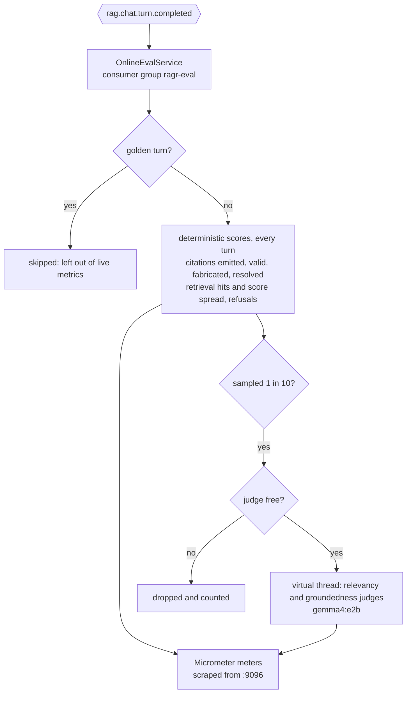
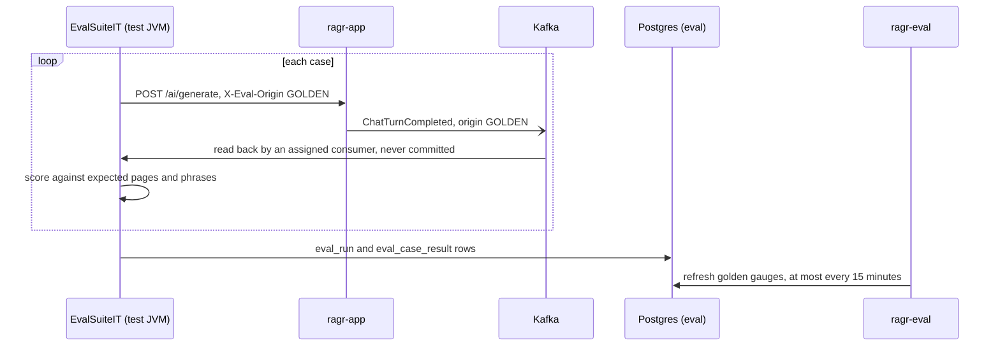

# ragr-eval

The evaluation application: it measures how good the chat service's answers are, without ever sitting
on the chat path. It scores every live turn that [ragr-app](../ragr-app/README.md) publishes to Kafka,
and runs a curated regression suite on demand. It serves nothing but actuator, on port **9096**, and
owns the `eval` schema with its own Flyway history. For how it fits with the other applications, see
the [root README](../README.md).

Nothing else publishes `rag_eval_*` metrics. If ragr-eval is not running, chat is unaffected and turns
are simply not scored.

## Two halves, split by one question

**Does the metric need to know what the right answer was?** Most do not. Citation validity and
fabrication, zero-hit rate, refusals and the LLM judges compare the answer against the context it was
given, which every real turn carries - so they run **online**, on live traffic. Only recall (hit rate,
mean reciprocal rank), context precision and expected-phrase coverage need known-correct pages, and
those are what the **golden suite** adds.

## Online evaluation



**Live traffic is scored automatically.** Every turn is checked against the context it was actually
given: how many citations it emitted, how many of those pointed at a page that was really retrieved,
whether anything was retrieved at all, whether the assistant refused. This is string comparison over
data carried in the event, so it runs on 100% of turns, seconds after they happen.

**Judging is sampled, and drops rather than queues.** A fraction of turns is also sent to two LLM
judges. It runs in this process after the answer has already been returned, but it is still sampled:
Ollama runs the chat model on one slot, so a judge call occupies it and the next user's generation
waits behind it. Over the concurrency bound a judgement is dropped and counted, never queued, so
judging never drifts behind the traffic it describes. A rising drop count means the sample rate is too
high.

**The judge is the chat model grading its own answers**, which makes the judged rates optimistic. A
dedicated judge would be better, but the smallest purpose-built one (`bespoke-minicheck`) needs
4.39 GiB and does not fit on a machine already holding the chat and embedding models. Read the judged
rates as a trend - a drop after a change is meaningful - rather than as an absolute quality score.

**Delivery is at most once, and a new consumer starts at the newest turn.** A turn the chat service
could not publish is lost. A new consumer group does not replay the three days the topic retains,
because judging all of it would occupy the Ollama runner live chat needs. Replaying is deliberate:
reset the `ragr-eval` group's offsets.

## The golden suite

A fixed set of 9 questions (`src/main/resources/eval/golden-dataset.yaml`), each with the pages known
to hold its answer, verified by reading the retrieved chunks rather than guessed. It is the only way to
measure retrieval recall.



It runs as a tagged test against the **running** chat service, so ragr-app must be up with the corpus
indexed - from IntelliJ or as a container, it makes no difference. On the reference machine stop
ragr-eval first (`./ragr.ps1 docker stop eval` if it is a container): the test JVM, ragr-app and ragr-eval together
leave almost no memory beside the two Ollama models, and the suite does not need ragr-eval. A run takes
several minutes.

```bash
./mvnw test -pl ragr-eval -am -Dsurefire.excludedGroups= -Dtest=EvalSuiteIT
```

`-Dgroups=eval` on its own will **not** run it: a JUnit tag exclusion beats an inclusion, so the
exclusion itself has to be cleared. `-pl ragr-eval -am` builds only what the suite needs and leaves the
running chat service's compiled classes alone.

The suite fails the build if any answer cites a page that does not exist (`MAX_INVENTED_PAGES` = 0),
if the citation fabrication rate exceeds 0.10, or if the retrieval hit rate falls below 0.6.

Results are written to `eval.eval_run` and `eval.eval_case_result`. The test JVM's own metrics are
never scraped, so the dashboard's golden panels are fed from those tables instead: ragr-eval reads the
latest run from Postgres, at most every 15 minutes, or on its next restart.

## Configuration

All of it is in `src/main/resources/application.yaml`; there are no profiles. Evaluation is configured
under `app.eval.*`:

| Property | Default | Purpose |
|---|---|---|
| `enabled` | `true` | Master switch for all evaluation |
| `topic` | `rag.chat.turn.completed` | The topic the chat service publishes turns to |
| `judge-model` | `gemma4:e2b` | Model used by the LLM judges - the chat model itself, see above |
| `online.judge-sample-rate` | `0.1` | Fraction of live answers sent to the judges. `0.0` keeps the free deterministic metrics and switches off the model calls |
| `online.max-concurrent-judgements` | `1` | Judgements in flight. Over this bound a judgement is **dropped and counted**, never queued |
| `online.judge-timeout-seconds` | `120` | How long one judge call may take; past it the call is interrupted and the rest of that judgement skipped |
| `online.judge-shutdown-wait-seconds` | `20` | How long shutdown waits for a judgement in flight before interrupting it; must fit inside the container's 40 s `stop_grace_period` |
| `golden.judged` | `false` | Whether a suite run also asks the judges, including one call per retrieved chunk for context precision. Roughly triples the run time |
| `golden.persist` | `true` | Write run and per-case rows to Postgres. Required for the dashboard's per-case tables **and** for its golden score panels |
| `golden.chat-url` | `http://localhost:8080` | The running chat service a suite run drives |
| `golden.turn-timeout` | `30s` | How long the suite waits for a turn to appear on Kafka after the answer returns |

## Dashboard

**ragr-eval — evaluation** in Grafana answers *are the answers any good?*

- **Live traffic** - every real chat turn: citation fabrication and validity, uncited answers,
  zero-hit rate, citation outcomes, the retrieval score distribution, sampled judge verdicts, and the
  judges' throughput, drops and errors.
- **Golden suite** - the age of the last run, hit rate, mean reciprocal rank, case pass rate, context
  precision and precision@k, scores over time, and per-case tables for the latest run and its history,
  read from the `eval` schema.

Counters are shown cumulatively rather than as rates: at a handful of chat turns an hour a per-second
rate is blank most of the time, and a rare event rounds to a flat zero that looks like a broken metric.
