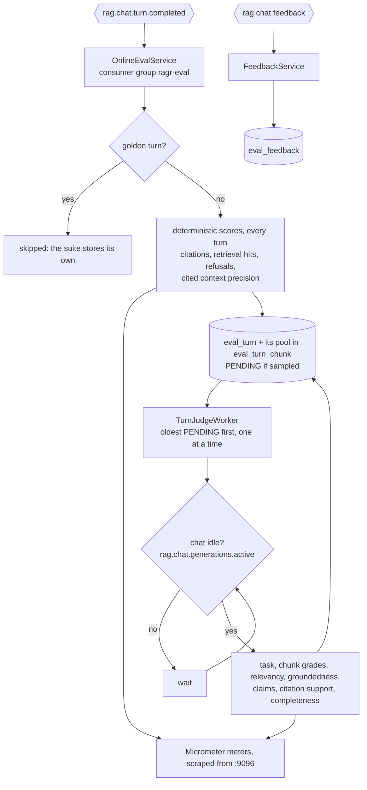
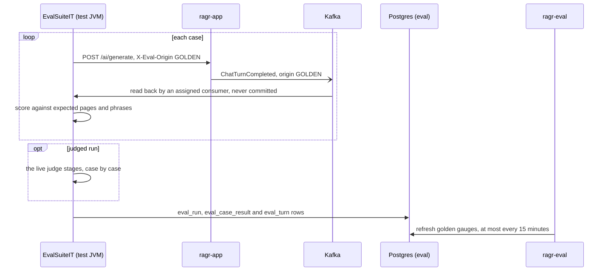

# ragr-eval

The evaluation application: it measures how good the chat service's answers are, without ever sitting
on the chat path. It stores and scores every live turn that [ragr-app](../ragr-app/README.md) publishes
to Kafka, judges them while chat is idle, records users' ratings and reviewers' verdicts, and runs a
curated regression suite on demand. It serves actuator and one small API (human review) on port
**9096**, and owns the `eval` schema with its own Flyway history. For how it fits with the other
applications, see the [root README](../README.md).

Nothing else publishes `rag_eval_*` metrics. If ragr-eval is not running, chat is unaffected and turns
wait on the topic (three days' retention) until it is.

## What it measures

Every metric of the "how do you measure RAG accuracy" framework, for both the golden suite and live
traffic:

| | Golden suite | Live traffic |
|---|---|---|
| **Retrieval** - Recall@K, Precision@K, MRR, NDCG | against verified expected pages, over the candidate pool | from the judge grading every chunk of the candidate pool |
| **Generation** - faithfulness, relevance, completeness, citation correctness | the same judges, on a judged run | the same judges, every sampled turn |
| **End to end** - success, task breakdown, debugging matrix | case pass rate and the judges' verdict | the judges' verdict, thumbs up/down, "asked again", human review |

**Live retrieval metrics come from a candidate pool.** ragr-app's one vector query fetches 10
candidates; the prompt gets the top-k above the similarity threshold, as it always has, and the event
carries the rest. The judge grades every candidate for the question - the whole answer, part of it, on
the topic only, or unrelated - and a chunk holding the whole answer or part of it is relevant.
Recall is *pooled* - relevant chunks in the prompt over relevant chunks in the pool - so it is an upper
bound: a relevant chunk ranked below the pool is invisible to it. The golden suite runs the same judge
and compares it chunk by chunk with pages verified by hand; that agreement is what says how far the live
numbers can be trusted.

**The judge is the chat model grading its own answers**, which makes the judged rates optimistic. A
dedicated judge would be better, but the smallest purpose-built one (`bespoke-minicheck`) needs 4.39 GiB
and does not fit on a machine already holding the chat and embedding models. Read the judged rates as a
trend - a drop after a change is meaningful - rather than as an absolute quality score. The judges reach
Ollama through `spring.ai.ollama.base-url`, so pointing that at another Ollama-compatible server moves
them off the chat model.

## Online evaluation



**Every turn is scored and stored on arrival.** Citation counts and validity, whether anything was
retrieved, refusals and cited context precision are string comparison over data the event carries, so
they cover 100% of turns within seconds. The turn and its whole candidate pool go into `eval_turn` and
`eval_turn_chunk`, so a quality panel can show the joint outcome of retrieval and generation on the
*same* turn, and a reviewer can read what was judged.

**Judging is queued and runs only while chat is idle.** The judges and chat share one Ollama runner that
serves one request at a time. Kafka took judging off the chat thread; the idle gate takes it off the chat
model: before every judge call the worker reads ragr-app's `rag.chat.generations.active` gauge and waits
while it is above zero. The most a user can wait is the one judge call already running, which is why
the judges are many short calls (1-22 s each, measured 6 Oct 2026) rather than a few long ones. A
grounded turn takes about 40-70 s of judge time; an ungrounded one only has its task classified.

**The queue is bounded by age, not by dropping.** A turn not judged within `judge.max-backlog-age` (6h)
is marked SKIPPED and counted, so the queue never describes traffic from hours ago. A steadily rising
`rag_eval_online_judge_skipped_total` means the sample rate is too high for the traffic.

**Users' signals.** A thumbs up/down from `POST /ai/turns/{turnId}/feedback` on ragr-app arrives on
`rag.chat.feedback` and is stored in `eval_feedback`. A follow-up in the same conversation within 5
minutes whose candidate pool overlaps the previous one's by at least 0.6 marks the previous turn
*asked again* - the implicit thumbs-down.

**Live turns are kept 14 days** (`retention.live-days`) and then deleted, with their pools and feedback.
They are the only place user questions are kept outside chat memory.

**Delivery is at most once, and a new consumer starts at the newest turn.** A turn the chat service
could not publish is lost. Replaying the topic is deliberate: reset the `ragr-eval` group's offsets.

## Human review

The dashboard's review queue lists unreviewed live turns worth a person's verdict: every thumbs-down,
every turn where the user and the judges disagree, and a random 5% (`online.review-sample-rate`). Record
a verdict - `CORRECT`, `PARTIAL` or `WRONG` - with:

```bash
curl -X PUT http://localhost:9096/eval/turns/<turnId>/review -H "Content-Type: application/json" -d '{"verdict":"CORRECT","notes":"optional"}'
```

204 on success, 404 for a turn that was never stored or has been purged. The dashboard compares each
verdict with the judges', which is the evidence for whether the self-judge is good enough.

## The golden suite

A fixed set of 9 questions (`src/main/resources/eval/golden-dataset.yaml`), each with the pages known
to hold its answer, verified by reading the retrieved chunks rather than guessed, a task category, and -
for a case listing several pages - whether the answer needs all of them or any one
(`expectedPagesMode`). `relevantPages` adds the other pages whose chunks state part of the answer,
found by reading a whole candidate pool by hand; only the judge's calibration reads them.

On top of the live metrics it adds the ones that need known-correct pages: page-level Recall@K, hit rate,
MRR, and precision and NDCG with expected-page chunks as the relevant ones. A judged run also stores
each case's turn in `eval_turn`, judged by exactly the same stages as live traffic.

**Context precision is also scored three ways**, because each relevance source is wrong in its own
direction. *Expected pages* counts a chunk as useful if it is on a page the dataset lists - a floor,
since the lists hold the pages containing the answer, not every useful page. *Cited* counts a chunk as
used if the answer cites its page - free and deterministic, but a passage used without a citation counts
as unused. *LLM judged* asks the judge per chunk whether the answer used it - read only its run average,
as a trend.



It runs as a tagged test against the **running** chat service, so ragr-app must be up with the corpus
indexed - from IntelliJ or as a container, it makes no difference. On the reference machine stop
ragr-eval first (`./ragr.ps1 docker stop eval` if it is a container): the test JVM, ragr-app and ragr-eval
together leave almost no memory beside the two Ollama models. The test JVM runs neither the listeners
nor the judge worker, so it never takes live turns.

```bash
./mvnw test -pl ragr-eval -am -Dsurefire.excludedGroups= -Dtest=EvalSuiteIT
```

Add `-Dapp.eval.golden.judged=true` to have the judges score the run as well. It takes several times
longer.

`-Dgroups=eval` on its own will **not** run it: a JUnit tag exclusion beats an inclusion, so the
exclusion itself has to be cleared. `-pl ragr-eval -am` builds only what the suite needs and leaves the
running chat service's compiled classes alone.

The suite fails the build if any answer cites a page that does not exist (`MAX_INVENTED_PAGES` = 0),
if the citation fabrication rate exceeds 0.10, or if the retrieval hit rate falls below 0.6.

## Configuration

All of it is in `src/main/resources/application.yaml`; there are no profiles. Evaluation is configured
under `app.eval.*`:

| Property | Default | Purpose |
|---|---|---|
| `enabled` | `true` | Master switch for all evaluation |
| `topic` | `rag.chat.turn.completed` | The topic the chat service publishes turns to |
| `feedback-topic` | `rag.chat.feedback` | The topic the chat service publishes ratings to |
| `judge-model` | `gemma4:e2b` | Model used by the judges - the chat model itself, see above |
| `online.judge-sample-rate` | `1.0` | Fraction of live turns queued for the judges. `0.0` keeps the free deterministic metrics and stores turns unjudged |
| `online.review-sample-rate` | `0.05` | Random share of live turns drawn into the review queue |
| `online.rephrase-window` / `rephrase-overlap` | `5m` / `0.6` | When a follow-up counts as the previous question asked again |
| `judge.worker-enabled` | `true` | Whether this process judges queued turns. Off in the golden suite's test JVM |
| `judge.max-backlog-age` | `6h` | A queued turn older than this is skipped and counted |
| `judge.call-timeout-seconds` | `120` | How long one judge call may take; past it the stage is recorded as unmeasured |
| `judge.shutdown-wait-seconds` | `20` | How long shutdown lets the turn in flight finish before interrupting it (it goes back to the queue); must fit inside the container's 40 s `stop_grace_period` |
| `judge.faithfulness-threshold` | `0.8` | Share of claims that must be supported for end-to-end success |
| `judge.max-claims` / `claims-num-predict` | `8` / `400` | Claims taken from one answer, and the generation cap for the two judges that write lists |
| `judge.idle-gate.enabled` | `true` | Hold judge calls while chat is generating. Off only if the judges use a different model server |
| `judge.idle-gate.chat-actuator-url` | `http://localhost:9095` | ragr-app's management port; `http://ragr-app:9095` in the container |
| `retention.live-days` | `14` | Live turns, pools and feedback older than this are deleted daily |
| `golden.judged` | `false` | Whether a suite run also asks the judges; `-Dapp.eval.golden.judged=true` turns it on for one run |
| `golden.persist` | `true` | Write run, case and turn rows to Postgres. Required for every golden panel |
| `golden.chat-url` | `http://localhost:8080` | The running chat service a suite run drives |
| `golden.turn-timeout` | `30s` | How long the suite waits for a turn to appear on Kafka after the answer returns |

## Dashboard

**ragr-eval — evaluation** in Grafana answers *are the answers any good?* Each section puts the golden
suite on the left and live traffic on the right:

- **Overview** - age of the last golden run, live turns and grounded share, the judge queue (waiting,
  oldest wait, skipped, errors, idle waits, time per turn), answer health counters and section-number
  citation repairs.
- **1. Retrieval** - Recall@K, Precision@K, MRR, NDCG and hit rate, per run and hourly; context
  precision three ways; relevant chunks the threshold left out; retrieval similarity.
- **2. Generation** - faithfulness, groundedness, relevance, completeness, citation support and
  validity, per run and hourly; citation outcomes; context used; fabrication, uncited and truncated
  answers.
- **3. End to end** - case pass rate and end-to-end success, the debugging matrix, a breakdown by task,
  thumbs up/down and "asked again", human agreement, latency.
- **Calibration** - the judge against the verified pages, against human review and against user ratings.
- **Drill-down** - the review queue, failing live turns with each stage's verdict and the chunk grades,
  and the golden per-case tables and run history.

Quality panels read the `eval` schema by when a turn happened; Prometheus carries the operational rates.
A **Task** variable filters the live panels. Golden trend panels show the last 30 days whatever the
dashboard range, because runs are rare, and re-ingests and golden runs are marked on every time axis.
Every rate is shown beside its sample size: at a handful of turns an hour, a rate rests on very few
verdicts.
