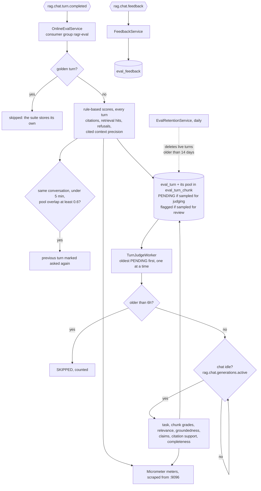
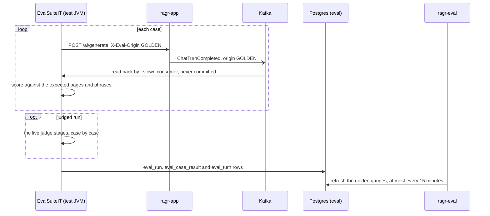

# ragr-eval

The evaluation service. It measures how good chat's answers are, without ever being in the way of
one. It runs on port **9096** (actuator, and one small API for human review) and owns the `eval`
schema, with its own Flyway history.

- **Live traffic.** Every answer [ragr-app](../ragr-app/README.md) publishes to Kafka is scored, stored
  and, while chat is idle, judged by the model.
- **Signals from people.** Users' thumbs up or down, and reviewers' verdicts.
- **The golden suite.** A fixed set of questions with known answers, run on demand.

Nothing else publishes `rag_eval_*` metrics. If ragr-eval is down, chat carries on and turns wait on
the topic (3 days' retention) until it is back.

How it fits with the other applications is in the [root README](../README.md).

## Design choices

- **Off the chat path, twice over.** Kafka takes scoring off chat's thread. An *idle gate* takes judging
  off chat's model: before every judge call the worker checks ragr-app's
  `rag.chat.generations.active` gauge, and waits while it is above zero.
- **Cheap scores for every turn, judges where it pays.** Rule-based scores (citations, retrieval hits,
  refusals) cost nothing and cover 100% of turns within seconds. The model-based judges are slower, so
  they run from a queue, one turn at a time.
- **Many short judge calls, not a few long ones.** A user arriving mid-judgement waits for at most the
  one call already running - 1 to 22 seconds each, measured 6 Oct 2026.
- **The same judges everywhere.** Live turns and the golden suite are judged by exactly the same
  stages, so the golden suite can check how far the live numbers can be trusted.
- **Score what the model saw.** The turn event carries every chunk in the prompt and the rest of the
  retrieved pool, so evaluation never re-queries the vector store and can measure what retrieval missed.
- **Old work is dropped, not done late.** A turn not judged within 6 hours is skipped and counted, so the
  queue never describes traffic from hours ago.

## What it measures

Every metric of the "how do you measure RAG accuracy" framework, for both the golden suite and live
traffic:

| | Golden suite | Live traffic |
|---|---|---|
| **Retrieval** - Recall@K, Precision@K, MRR, NDCG | against hand-checked expected pages, over the candidate pool | from the judge grading every chunk in the candidate pool |
| **Generation** - faithfulness, relevance, completeness, citation correctness | the same judges, on a judged run | the same judges, on every sampled turn |
| **End to end** - success, task breakdown, debugging matrix | case pass rate and the judges' verdict | the judges' verdict, thumbs up/down, "asked again", human review |

**Live retrieval metrics come from the candidate pool.** ragr-app's one vector query fetches 10
chunks; the prompt gets the top 5 above the threshold, and the event carries the rest. The judge grades
every chunk against the question - the whole answer, part of it, on the topic only, or unrelated - and a
chunk with the whole answer or part of it counts as relevant. Recall is *pooled*: relevant chunks in
the prompt divided by relevant chunks in the pool. That makes it an upper bound, since a relevant chunk
ranked below the pool is invisible to it.

**The judge is the chat model grading its own answers**, which makes the judged rates optimistic. A
dedicated judge would be better, but the smallest one built for the job (`bespoke-minicheck`) needs
4.39 GiB and does not fit beside the chat and embedding models. Read the judged rates as a trend - a
drop after a change means something - not as an absolute score. To move the judges to another model
server, point `spring.ai.ollama.base-url` at it.

## Online evaluation



**Every turn is scored and stored on arrival.** The rule-based scores are string comparisons over data
the event already carries. The turn and its whole pool go into `eval_turn` and `eval_turn_chunk`, so a
dashboard panel can show retrieval and generation for the *same* turn, and a reviewer can read exactly
what was judged.

**What a turn costs to judge.** A grounded turn takes about 40-70 s of judge time, spread over many
short calls. An ungrounded one - nothing cleared the similarity threshold, so the model answered from
general knowledge - only has its task classified and its pool graded, about 6 s; its answer is never
judged. A relevant chunk in that pool means a recall of 0: the threshold dropped context the answer
could have used.

**Watch the skipped counter.** A steadily rising `rag_eval_online_judge_skipped_total` means the
sample rate is too high for the traffic.

**Signals from users.**
- *Thumbs up or down*, from `POST /ai/turns/{turnId}/feedback` on ragr-app, arrives on
  `rag.chat.feedback` and is stored in `eval_feedback`.
- *Asked again* is the implicit thumbs-down: a follow-up in the same conversation within 5 minutes whose
  pool overlaps the previous one's by at least 0.6 marks the previous answer as asked again.

**Live turns are kept 14 days** (`retention.live-days`), then deleted with their pools and feedback.
They are the only copy of users' questions outside chat memory, which expires from Redis after 24 hours.

**Delivery is at most once, and a new consumer starts at the newest turn.** A turn chat could not
publish is lost. To replay the topic on purpose, reset the `ragr-eval` group's offsets.

## Human review

The dashboard's review queue lists unreviewed live turns worth a person's verdict: every thumbs-down,
every turn where the user and the judges disagree, and a random 5% (`online.review-sample-rate`).
Record a verdict - `CORRECT`, `PARTIAL` or `WRONG` - with:

```bash
curl -X PUT http://localhost:9096/eval/turns/<turnId>/review -H "Content-Type: application/json" -d '{"verdict":"CORRECT","notes":"optional"}'
```

204 on success; 404 for a turn never stored, or already purged. The dashboard compares each verdict
with the judges'. That comparison is the evidence for whether the model is good enough to judge itself.

## The golden suite

11 questions in `src/main/resources/eval/golden-dataset.yaml`. Each case has:

| Field | Meaning |
|---|---|
| `expectedPages` | The pages that hold the answer, checked by reading the retrieved chunks rather than guessed |
| `expectedPagesMode` | For several pages: whether the answer needs all of them or any one |
| `relevantPages` | Other pages that hold part of the answer, found by reading a whole pool by hand. Used only to calibrate the judge |
| `task` | The kind of question, for the per-task breakdown |
| `mustContain`, `mustNotContain` | Phrases the answer must or must not contain, case-insensitive |
| `mustNotMatch` | Regular expressions the answer must not match - for a wrong answer that uses the same words as a right one |

On top of the live metrics, the suite adds those that need known-correct pages: page-level Recall@K,
hit rate, MRR, and precision and NDCG with expected-page chunks as the relevant ones. A judged run
also stores each case's turn in `eval_turn`, judged by the same stages as live traffic.

**Context precision is scored three ways**, because each way of deciding "was this chunk useful?" is
wrong in its own direction:

- *Expected pages* - useful if it is on a page the dataset lists. A floor: the lists hold the pages with
  the answer, not every useful page.
- *Cited* - used if the answer cites its page. Free and exact, but a passage used without a citation
  counts as unused.
- *Judged* - the judge says per chunk whether the answer used it. Read only its run average, as a trend.



**Running it.** The suite is a tagged test that drives the **running** chat service, so ragr-app must be
up with the corpus stored - from IntelliJ or as a container, either works. On the reference machine,
stop ragr-eval first (`./ragr.ps1 docker stop eval` if it is a container): the test JVM, ragr-app and
ragr-eval together leave almost no memory beside the two models. The test JVM runs neither the Kafka
listeners nor the judge worker, so it never takes live turns.

```bash
./mvnw test -pl ragr-eval -am -Dsurefire.excludedGroups= -Dtest=EvalSuiteIT
```

- Add `-Dapp.eval.golden.judged=true` to have the judges score the run too. It takes several times
  longer.
- `-Dgroups=eval` alone does **not** run it. A JUnit tag exclusion beats an inclusion, so the exclusion
  itself has to be cleared.
- `-pl ragr-eval -am` builds only what the suite needs, and leaves the running chat service's classes
  alone.

The suite fails the build if any answer cites a page that does not exist (`MAX_INVENTED_PAGES` = 0),
if the citation fabrication rate is above 0.10, or if the retrieval hit rate is below 0.6.

## Configuration

All of it is in `src/main/resources/application.yaml`. There are no profiles. Evaluation is configured
under `app.eval.*`:

| Property | Default | Purpose |
|---|---|---|
| `enabled` | `true` | Turns all evaluation on or off |
| `topic` | `rag.chat.turn.completed` | Where chat publishes turns |
| `feedback-topic` | `rag.chat.feedback` | Where chat publishes ratings |
| `judge-model` | `gemma4:e2b` | The judges' model - the chat model itself, see above |
| `online.judge-sample-rate` | `1.0` | Share of live turns queued for judging. `0.0` keeps the free scores and stores turns unjudged |
| `online.review-sample-rate` | `0.05` | Random share of live turns put in the review queue |
| `online.rephrase-window` / `rephrase-overlap` | `5m` / `0.6` | When a follow-up counts as the same question asked again |
| `judge.worker-enabled` | `true` | Whether this process judges queued turns. Off in the golden suite's test JVM |
| `judge.max-backlog-age` | `6h` | A queued turn older than this is skipped and counted |
| `judge.call-timeout-seconds` | `120` | Longest one judge call may take; past it, that stage is recorded as not measured |
| `judge.shutdown-wait-seconds` | `20` | How long shutdown lets the turn being judged finish before interrupting it (it goes back in the queue). Must fit inside the container's 40 s `stop_grace_period` |
| `judge.faithfulness-threshold` | `0.8` | Share of claims that must be supported for an answer to count as a success |
| `judge.max-claims` / `claims-num-predict` | `8` / `400` | Most claims taken from one answer, and the output limit for the two judges that write lists |
| `judge.idle-gate.enabled` | `true` | Hold judge calls while chat is generating. Turn off only if the judges use a different model server |
| `judge.idle-gate.chat-actuator-url` | `http://localhost:9095` | ragr-app's actuator; `http://ragr-app:9095` in the container |
| `retention.live-days` | `14` | Live turns, pools and feedback older than this are deleted daily |
| `golden.judged` | `false` | Whether a suite run is also judged; `-Dapp.eval.golden.judged=true` turns it on for one run |
| `golden.persist` | `true` | Write run, case and turn rows to Postgres. Every golden panel needs it |
| `golden.chat-url` | `http://localhost:8080` | The running chat service a suite run drives |
| `golden.turn-timeout` | `30s` | How long the suite waits for a turn to appear on Kafka after the answer returns |

## Dashboard

**ragr-eval — evaluation** in Grafana answers *are the answers any good?* Each section puts the golden
suite on the left and live traffic on the right:

- **Overview** - age of the last golden run, live turns and grounded share, the judge queue (waiting,
  oldest wait, skipped, errors, idle waits, time per turn), answer health counters and section-number
  citation repairs.
- **1. Retrieval** - Recall@K, Precision@K, MRR, NDCG and hit rate, per run and hourly; context
  precision three ways; relevant chunks the threshold left out; retrieval scores.
- **2. Generation** - faithfulness, groundedness, relevance, completeness, citation support and
  validity, per run and hourly; citation outcomes; context used; fabricated, uncited and cut-off answers.
- **3. End to end** - case pass rate and end-to-end success, the debugging matrix, a breakdown by task,
  thumbs up/down and "asked again", agreement with human review, latency.
- **Calibration** - the judge against the hand-checked pages, against human review and against user
  ratings.
- **Drill-down** - the review queue, failing live turns with each stage's verdict and chunk grades, and
  the golden per-case tables and run history.

Quality panels read the `eval` schema, by when each turn happened. Prometheus carries the operational
rates. A **Task** variable filters the live panels. Golden trend panels always show the last 30 days,
since runs are rare, and re-ingests and golden runs are marked on every time axis. Every rate is shown
beside how many turns it rests on: at a few turns an hour, a rate can rest on very few verdicts.
