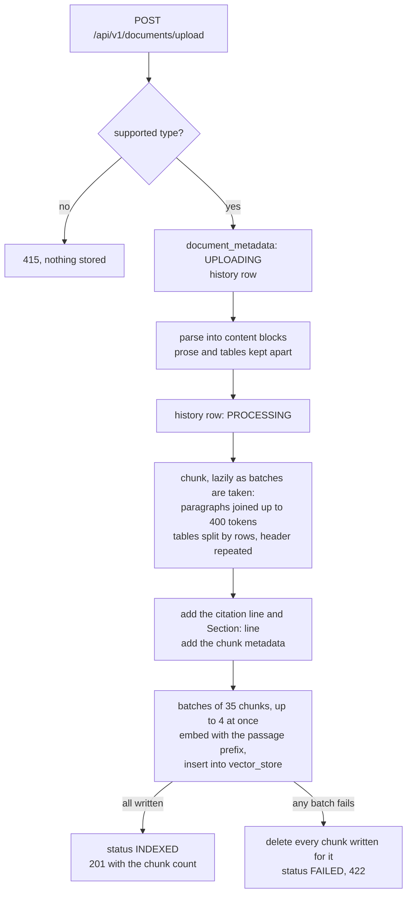

# ragr-ingest

The ingestion service. It takes an uploaded document, parses it, splits it into chunks, embeds them
with Ollama and stores them in pgvector, where [ragr-app](../ragr-app/README.md) searches them. It runs
on port **8081** (actuator **9097**) and owns the `public` schema's Flyway migration, `vector_store`
included.

How it fits with the other applications is in the [root README](../README.md).

## Design choices

- **Tables are kept whole.** Parsing produces prose blocks and table blocks separately, so a chunk never
  cuts through a table or mixes it with the text around it. A large table is split by rows, with its
  header repeated in every piece.
- **Every chunk says where it came from.** The citation line `[filename, p. N]` is part of the chunk's
  text, embedded and stored with it. It is the only way the chat model knows which page it is reading.
- **One page per chunk.** PDF pages are parsed one at a time, so a chunk never spans two pages and its
  page number is always exact.
- **All or nothing.** If any batch fails, every chunk already written for that document is deleted and
  the document is marked `FAILED`. Search never sees half a document.
- **Every step is recorded.** Each status change goes to `document_metadata_history`, which is kept
  even after the document is deleted.
- **Parsing and storing use different threads.** Parsing is CPU work, on a small fixed pool. Embedding
  and writing mostly wait on Ollama and Postgres, so they run on virtual threads, at most 4 batches at
  once.

## The flow



### Parsing

- **PDFs** are read as positioned text. Tables are recovered from the page layout, from ruling lines or
  from how the text lines up in columns (`table-detection`). Two things are removed because they offered
  the model a second, wrong page number to cite: the printed page numbers in footers, and the entries of
  a table of contents.
- **Everything else** - DOCX, XLSX, PPTX, HTML, TXT, MD and CSV - goes through Apache Tika, whose XHTML
  output keeps table markup. These formats have no pages, so their chunks have no page number.

### What a stored chunk looks like

```
[spring-boot-reference.pdf, p. 301]
Section: Customizing the Management Server Port

Properties
management.server.port=8081 ...
```

- **The citation line** is the first line. For formats without pages it is just `[filename]`.
- **The `Section:` line** appears when a chunk starts part-way through a numbered section. It tells the
  model what the text is about when the heading fell in the chunk before. Without it, the model gave
  this chunk's `management.server.port` as the way to move the *application* off port 8080. Chunks break
  at numbered headings, so a chunk that opens with its own heading needs no section line.
- **Anything that reads chunks back** - export, re-ranking, re-chunking - must remove both lines first,
  with `CitationParser.stripHeader`.

**Metadata.** Each chunk carries the keys in `ragr-shared`'s `ChunkMetadata`:

| Key | Meaning |
|---|---|
| `documentId`, `fileName`, `contentType` | The document it came from |
| `pageNumber` | Its page; absent for formats without pages |
| `chunkIndex` | Its position in the document |
| `blockType` | `prose` or `table` |
| `tableIndex`, `tableRows` | For table chunks only |
| `section` | The numbered heading it falls under: the first one inside it, or else the last one before it |
| `pipelineVersion` | A hash of everything that shaped it: the chunk settings, `IngestionProperties.PARSER_REVISION`, the embedding model and its task prefix |

**Bump `PARSER_REVISION`** with any parsing change that alters chunk text. No setting changes in that
case, so without the bump the pipeline version would not either. The version lets evaluation separate
results from before and after a change; it does not allow a mixed corpus.

## Configuration

All of it is in `src/main/resources/application.yaml`. There are no profiles. The embedding model
(`nomic-embed-text`, 768 dimensions) must be the same as ragr-app's - see the
[root README](../README.md#the-applications-never-call-each-other).

`app.embedding.task-prefix` (`search_document: `) is added to every chunk sent to the embedding model,
but never stored. nomic-embed-text was trained with it, and Ollama does not add it. It pairs with
ragr-app's query prefix and changes with the model.

Indexing is tuned under `app.ingestion.*`. **Changing a setting that shapes chunks means re-ingesting
every document.** `batch-size`, `concurrency` and the retry settings only change the speed.

| Property | Default | Purpose |
|---|---|---|
| `chunk-size` | `400` | Target chunk size, in **tokens**. Paragraphs are joined until the next would go over it. Tables are chunked separately, by rows |
| `min-chunk-length-to-embed` | `100` | A chunk shorter than this many **characters** is merged into the one before it - never thrown away |
| `min-chunk-size-chars` | `150` | Where the splitter starts looking for a sentence end when cutting an over-long chunk. Not a minimum length |
| `max-num-chunks` | `10000` | Most chunks per document |
| `max-embed-tokens` | `2048` | The embedding model's input limit. Only a single very wide table row can go over it, and the parser warns when one does |
| `table-detection` | `auto` | Find tables in PDFs: `off`, `auto`, `lattice` (ruling lines) or `stream` (text alignment). `auto` decides per page. `off` uses the plain page-text reader |
| `batch-size` | `35` | Chunks per embedding call and insert. What it really controls is tokens: ~9,100 per batch at today's chunk size. Revisit it if `chunk-size` changes |
| `concurrency` | `4` | Batches stored at once. Must stay well below the database pool size (20) |
| `max-attempts` / `retry-backoff` | `3` / `2s` | Retries, only when the Ollama model runner cannot be reached. Every other failure fails at once |

Uploads are limited to 25 MB per file and 50 MB per request (`spring.servlet.multipart`).

## Documents API (`/api/v1/documents`)

| Method | Path | Description |
|---|---|---|
| POST | `/api/v1/documents/upload` | Upload and store one document (PDF, DOCX, XLSX, PPTX, HTML, TXT, MD, CSV) |
| POST | `/api/v1/documents/upload-multiple` | Upload several. 201 if all were stored, 207 if some failed, 422 if none were |
| GET | `/api/v1/documents` | List every document and its status |
| GET | `/api/v1/documents/{id}` | One document's metadata |
| GET | `/api/v1/documents/{id}/history` | One document's status history, oldest first |
| DELETE | `/api/v1/documents/{id}` | Delete a document and all its chunks |

```bash
curl -F "file=@document.pdf" http://localhost:8081/api/v1/documents/upload

# Several at once - one result per file, in the order sent
curl -F "files=@a.pdf" -F "files=@b.docx" http://localhost:8081/api/v1/documents/upload-multiple

curl "http://localhost:8081/api/v1/documents/<id>/history"
```

OpenAPI docs: `http://localhost:8081/swagger-ui.html`.

**Uploads are synchronous.** The request returns only once the document is fully stored, with the
number of chunks created. A large document takes minutes - the 645-page, 13.6 MB reference manual takes
3-4 minutes with the integrated GPU on - so set a generous client timeout.

**A failed upload leaves nothing searchable.** Every chunk already written is removed and the document
is marked `FAILED`. Upload it again to retry.

**The file type is checked before anything is stored.** Accepted: `.pdf`, `.docx`, `.xlsx`, `.pptx`,
`.html`/`.htm`, `.txt`, `.md`, `.csv`. Anything else is a **415** and leaves no record. The check reads
the file extension, and uses the declared `Content-Type` only when there is no extension, because
clients often send `application/octet-stream` for everything.

This is a type check, not a content check. A file with a supported extension that cannot be parsed - a
corrupt PDF, say - is a **422**, and *does* leave a `FAILED` record with its history.

**Bulk upload reports every file, including failures.** A file that fails gets a `FAILED` entry with
its document id and the error, so ten files sent always means ten results back. Follow a failed
entry's `id` to `/{id}/history` for the full story. A rejected type is a `FAILED` entry with a **null
id**, since no document was created for it.

Files in a bulk upload are processed one at a time. Ollama embeds on one slot however many requests
arrive, so parallel uploads would only add contention.

**History outlives the document.** The history endpoint lists each status change with the details
recorded at the time: `UPLOADING` → `PROCESSING` → `INDEXED`, or ending in `FAILED` with the error.
The history table deliberately has no foreign key to the documents table, so deleting a document
removes its metadata and chunks but keeps its history. The endpoint still answers for a deleted
document, with `documentExists: false`, and returns 404 only when there is no history at all. It is the
only place a failure's reason survives once the document is gone.

**There is no re-index endpoint.** After a pipeline change, delete every document and upload them all
again - see the [root README](../README.md#changing-the-pipeline-means-re-ingesting-everything).

## Dashboard

**ragr-ingest — ingestion** in Grafana answers *is storing documents healthy?* It shows one row per
upload with its outcome, chunk count and time split into parsing and embedding-plus-writing (read from
`document_metadata_history` through the Postgres data source); document API requests; embedding calls,
latency and throughput; vector-store write latency; and the current row count of `vector_store`. The
top bar links to this application's Swagger UI.
