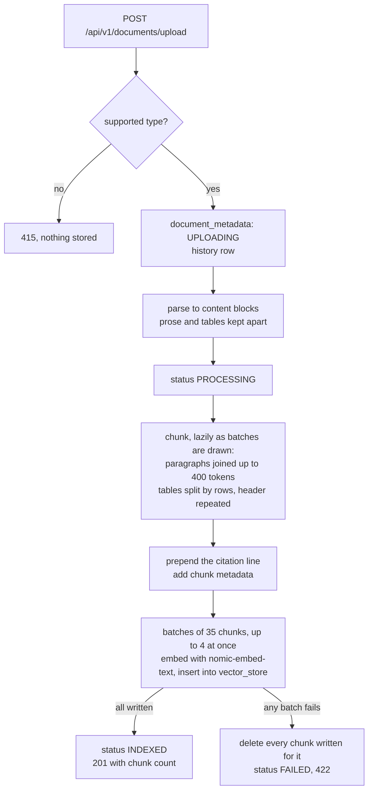

# ragr-ingest

The ingestion service: it takes an uploaded document, parses it, splits it into chunks, embeds them
with Ollama and writes them to pgvector, where [ragr-app](../ragr-app/README.md) searches them.
It runs on port **8081**, actuator on **9097**, and owns the `public` schema's Flyway migration,
`vector_store` included. For how it fits with the other applications, see the
[root README](../README.md).

## The flow



Every status change is also written to `document_metadata_history`, so each document keeps a
trail from upload to its outcome.

### Parsing

Documents are parsed into a list of content blocks, each either **prose** or a **table**, so that a
table is never cut through or merged with the text around it.

- **PDFs** are read from positioned text, with tables recovered from the page geometry (ruling lines
  or column alignment, under `table-detection`). The printed page numbers in page footers and the
  entries of a table of contents are stripped: left in, they offered the model a second, wrong page
  number to cite. Each page is parsed separately, so every chunk belongs to exactly one page.
- **Everything else** - DOCX, XLSX, PPTX, HTML, TXT, MD and CSV - goes through Apache Tika, whose
  XHTML output keeps the table markup. These formats have no pages, so their chunks carry no page
  number and a whole file is one unit.

### What a stored chunk looks like

Each chunk's text begins with a citation line, which is embedded and stored as part of the content.
A chunk that starts part-way through a numbered section also names it, on a second line:

```
[spring-boot-reference.pdf, p. 301]
Section: Customizing the Management Server Port

Properties
management.server.port=8081 ...
```

The citation line is the reason the chat model can cite pages at all. The section line tells it what an
example configures when the heading fell in the chunk before - without it, the model gave this one's
`management.server.port` as the way to move the application off port 8080. Chunks break at numbered
headings, so a chunk that opens with its own heading has no section line. Anything that reads chunks
back - export, re-ranking, re-chunking - must strip both, with `CitationParser.stripHeader`. For
formats without pages the citation line is just `[filename]`, and there is no section line.

Each chunk's metadata carries the keys defined in `ragr-shared`'s `ChunkMetadata`: `documentId`,
`fileName`, `contentType`, `pageNumber`, `chunkIndex` and `blockType` (`prose` or `table`), plus
`tableIndex` and `tableRows` for table chunks, and two for evaluation: `section`, the numbered heading the
chunk falls under (the first heading inside it, else the last one before it), and `pipelineVersion`, a
hash of the chunk-shaping settings, `IngestionProperties.PARSER_REVISION`, the embedding model and its
task prefix. Bump
`PARSER_REVISION` with any parsing change that alters chunk content, so evaluation can tell chunks from
either side of it apart. The policy is still one pipeline per corpus - re-ingest everything after a
change; the version records which pipeline that was.

## Configuration

All of it is in `src/main/resources/application.yaml`; there are no profiles. The embedding model and
its dimensions (`nomic-embed-text`, 768) must match ragr-app's - see the
[root README](../README.md#the-applications-never-call-each-other).

`app.embedding.task-prefix` (`search_document: `) is prepended to every chunk sent to the embedding
model, never stored: nomic-embed-text was trained with it, and Ollama does not add it. It pairs with
ragr-app's query prefix and changes with the model, and changing it means re-ingesting every document.

Indexing is tuned under `app.ingestion.*`. **Changing any setting that shapes chunks means
re-ingesting every document**; `batch-size`, `concurrency` and the retry settings only change how
fast.

| Property | Default | Purpose |
|---|---|---|
| `chunk-size` | `400` | Target chunk size in **tokens**. Consecutive paragraphs are joined until adding the next would exceed it, so chunks actually reach this budget. Tables are chunked separately, by rows |
| `min-chunk-length-to-embed` | `100` | Chunks shorter than this many **characters** are merged into the chunk before them, never discarded. Raise it if single-line noise is polluting retrieval |
| `min-chunk-size-chars` | `150` | Where the splitter looks for a sentence boundary when cutting an over-budget chunk. Not a minimum chunk length |
| `max-num-chunks` | `10000` | Upper bound on chunks per document |
| `max-embed-tokens` | `2048` | The embedding model's context. Only a single table row wider than this can exceed it, and the parser warns when one does |
| `table-detection` | `auto` | Recover tables from PDFs (`off`/`auto`/`lattice`/`stream`). `auto` picks per page: ruled pages take columns from the rules, unruled ones from text alignment. Set `off` to fall back to the plain page-text reader |
| `batch-size` | `35` | Chunks embedded and written per batch. The cost it controls is *tokens*: ~9.1k per batch at the measured mean of 261 tokens per chunk, so revisit it if you change `chunk-size` |
| `concurrency` | `4` | Batches written in parallel. Must stay well below `spring.datasource.hikari.maximum-pool-size` (20) |
| `max-attempts` / `retry-backoff` | `3` / `2s` | Retries, only for an unreachable Ollama model runner; other failures fail fast |

Uploads are limited to 25MB per file and 50MB per request (`spring.servlet.multipart`).

## Documents API (`/api/v1/documents`)

| Method | Path | Description |
|---|---|---|
| POST | `/api/v1/documents/upload` | Upload and index a single document (PDF, DOCX, XLSX, PPTX, HTML, TXT, MD, CSV) |
| POST | `/api/v1/documents/upload-multiple` | Upload and index multiple documents at once. 201 all indexed, 207 some failed, 422 none indexed |
| GET | `/api/v1/documents` | List all uploaded documents and their indexing status |
| GET | `/api/v1/documents/{id}` | Get metadata for a specific document |
| GET | `/api/v1/documents/{id}/history` | Get the document's processing history, oldest entry first |
| DELETE | `/api/v1/documents/{id}` | Delete a document and purge its vector embeddings |

```bash
curl -F "file=@document.pdf" http://localhost:8081/api/v1/documents/upload

# Several at once — one result per file, in the order sent
curl -F "files=@a.pdf" -F "files=@b.docx" http://localhost:8081/api/v1/documents/upload-multiple

curl "http://localhost:8081/api/v1/documents/<id>/history"
```

OpenAPI docs: `http://localhost:8081/swagger-ui.html`.

**Uploads are synchronous.** The request does not return until the document is fully indexed, and a
large one takes minutes: the 645-page, 13.6MB reference manual indexes in about 3–4 minutes with the
integrated GPU enabled. Set a generous client timeout. The response reports the number of chunks
created.

**Indexing is all-or-nothing.** If any batch fails, every chunk already written for that document is
removed and the document is marked `FAILED`, so a failed upload never leaves partial content to be
retrieved. Re-uploading is the way to retry.

**Supported types are checked before anything is stored.** `.pdf`, `.docx`, `.xlsx`, `.pptx`,
`.html`/`.htm`, `.txt`, `.md` and `.csv` are accepted; anything else returns **415** and leaves no
document record behind. The check reads the filename extension, falling back to the declared
`Content-Type` only when the filename has no extension. Clients frequently send
`application/octet-stream`, so a declared type is treated as a fallback rather than as evidence.

This is a type filter, not a content scanner. A supported extension whose contents cannot actually be
parsed - a corrupt PDF, say - still returns **422** and *does* leave a `FAILED` record with its
history, because that is a processing failure rather than a rejected type.

**Bulk upload reports every file, including the ones that failed.** A file that cannot be processed
gets a `FAILED` entry carrying its document id and the error, rather than being dropped from the
response, so a batch of ten that returns seven successes also returns three failures, each
identifying itself. Follow a failed entry's `id` to `/{id}/history` for the full trail. A rejected
type appears as a `FAILED` entry with a **null id**, since no document was ever created for it. The
status code summarises the batch: **201** when every file indexed, **207 Multi-Status** when some
failed, **422** when none did.

Files are processed one at a time. Ollama embeds on a single slot however many requests arrive, so
uploading concurrently would add contention without adding throughput.

**History outlives the document it describes.** The history endpoint returns each status transition
with the details recorded at the time: `UPLOADING` → `PROCESSING` → `INDEXED` on success, or ending in
`FAILED` with the error message when parsing or indexing broke. `document_metadata_history` is an
immutable audit log with deliberately no foreign key to `document_metadata`, so deleting a document
removes its metadata and chunks but leaves the trail. The endpoint still answers for a deleted
document, reporting `documentExists: false`, and 404s only when no history exists for the id at all.
It is the only place a failure reason is kept once a document has been removed.

**There is no re-index endpoint.** After a pipeline change, delete every document and upload them all
again - see the [root README](../README.md#changing-the-pipeline-means-re-ingesting-everything).

## Dashboard

**ragr-ingest — ingestion** in Grafana answers *is indexing healthy?*: one row per upload with its
outcome, chunk count and time split into parsing and embedding-plus-writing, read from
`document_metadata_history` through the Postgres datasource; document API requests; embedding calls, latency and throughput; vector-store write
latency; and the live row count of `vector_store`. A **Swagger UI** link in the top bar opens this
application's API docs.
